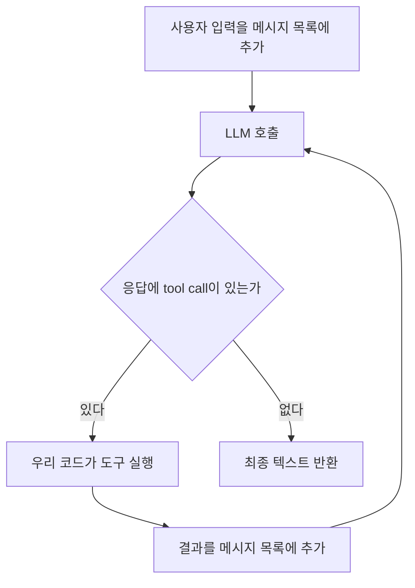

# Agents

## 1. Overview

원문: https://mastra.ai/docs/agents/overview

### 1-1. 에이전트란 무엇인가

문서의 정의는 이렇다. "LLM과 도구를 써서 열린 문제를 푼다. 목표를 놓고 추론해서 어떤 도구를 쓸지 정한다. 대화 기억을 유지하고, 모델이 최종 답을 내놓거나 정지 조건에 걸릴 때까지 반복한다."

#### 에이전트 루프

LLM API 호출 한 번은 "메시지 목록을 넣으면 텍스트 한 덩어리가 나온다"로 끝난다. 모델 자체는 파일을 읽거나 외부 API를 부를 수 없다. 그래서 모델에게 사용할 수 있는 함수 목록을 알려 주고, 모델이 "이 함수를 이 인자로 호출하고 싶다"는 응답을 내놓으면 우리 코드가 대신 실행해서 결과를 메시지 목록에 넣고 모델을 다시 호출한다. 모델이 함수 호출 없이 일반 텍스트로 답할 때까지 이 과정을 반복하는 것이 에이전트 루프이고, 모델이 함수 호출 의사를 표현하는 규약이 tool calling이다.



Claude Code가 이 루프 그대로다. Bash나 WebFetch 호출이 tool call이고, 그 결과가 다시 모델 입력으로 들어가 다음 판단을 한다. Mastra의 `Agent` 클래스는 이 루프를 직접 짜지 않아도 되게 감싼 것이다.

문서 정의의 각 구절은 루프의 요소와 대응한다.

- "어떤 도구를 쓸지 정한다": 모델이 tool call을 내놓는 판단
- "대화 기억을 유지한다": 루프를 돌 때마다 메시지 목록이 누적된다는 뜻
- "정지 조건": 무한 루프를 막는 장치. 최대 반복 횟수(`maxSteps`) 같은 값

#### 언제 에이전트를 쓰는가

문서는 "단계를 미리 알 수 없는 열린 작업에는 agent, 순서가 정해진 다단계 처리에는 workflow"라고 구분한다. 구분의 본질은 제어 흐름을 누가 정하는가다.

| | Agent | Workflow |
|---|---|---|
| 다음 단계를 정하는 주체 | 모델 | 개발자가 코드로 |
| 실행 경로 | 호출마다 달라질 수 있다 | 항상 같다 |
| 적합한 일 | "이 문서에서 근거를 찾아 답해라" | "PDF를 받아 추출, 청킹, 임베딩 순으로 처리해라" |

모델에게 순서를 맡기면 호출 횟수만큼 비용과 지연이 늘고 결과도 호출마다 흔들리기 때문에, 순서가 이미 정해진 일은 코드로 고정하는 편이 낫다. clap-agent에서 사용자 질문에 답하는 것은 agent이고, 정해진 주기로 평가를 돌리는 것은 workflow(`src/mastra/workflows/scheduled-evals-workflow.ts`)인 것이 이 기준 때문이다.

### 1-2. Quickstart: 첫 에이전트 만들기

#### 필수 속성

| 속성 | 뜻 | 일반 개념 |
|---|---|---|
| `id` | 코드에서 에이전트를 찾는 키 | `getAgentById`의 인자 |
| `name` | 사람이 읽는 표시 이름 | Studio와 트레이스에 표시 |
| `instructions` | 역할·성격·규칙을 적은 문장 | system prompt. 매 호출마다 메시지 목록 맨 앞에 들어간다 |
| `model` | `provider/모델명` 문자열 | model router가 해석해 provider의 API 키를 찾는다 |

#### 등록

`new Agent()` 직후의 객체는 자기 설정만 갖고 있다. `new Mastra({ agents })`를 거치면 `addAgent`가 logger, storage, 다른 에이전트 목록을 주입한다. (`@mastra/core/dist/mastra-*.js`의 `addAgent`) 주입은 객체를 직접 수정하므로, `Mastra`를 만드는 코드가 실행되지 않는 별도 스크립트에서만 주입 없이 "홀로 동작"한다.

| 메서드 | 찾는 기준 |
|---|---|
| `getAgent(key)` | 등록할 때 쓴 객체 키 (`todoAgent`) |
| `getAgentById(id)` | `Agent`의 `id` (`todo-agent`) |

#### 실습 결과

- `src/mastra/agents/todo-agent.ts`: 할 일 관리 에이전트. clap-agent 관례대로 id·키는 `constants.ts`, 모델 문자열은 `models.ts`, system prompt는 `todo-agent.prompt.ts`로 분리했다. 검사 도구는 biome(`npm run check`)과 tsc(`npm run typecheck`)다.
- Google이 새 사용자에게 `gemini-2.5-flash`를 막아서 `gemini-3.6-flash`로 바꿨다. 오류 문구는 Mastra가 아니라 provider가 돌려준 것이다.
- Studio를 다시 열면 대화 목록이 사라진다. Memory와 storage가 없어 in-memory 저장소로 동작하기 때문이다. (8·9회차)

#### clap-agent

- 생성: `src/mastra/agents/clap-agent.ts:94`. `instructions`와 `model`은 본체와 실험용 변형이 공유하는 설정 객체에 있다. (`:66`)
- `instructions`는 함수다. (`:72`) 요청마다 `requestContext`를 받아 대화 맥락 블록을 덧붙인다. 정본 프롬프트는 `clap-agent.prompt.ts:4`.
- `model`은 폴백 배열이다. (`:23`) Anthropic 실패 시 OpenAI로 넘어간다. 모델 문자열은 `models.ts`에 상수로 두고 `satisfies Record<string, RegisteredModelId>`로 오타를 막는다.
- 등록: `src/mastra/index.ts:81-82`. storage, logger, observability가 함께 넘어간다.
- 조회: 서버 라우트와 도구는 `getAgentById` (`server/review-thread-get.ts:43`, `tools/generate-report-tool.ts:66`), 평가 스크립트는 `getAgent(CLAP_AGENT_KEY)` (`evals/tool-calls-evals.ts:44`). 상수는 `constants.ts:3-4`.
- `name`은 상수로 빼지 않는다. id·키는 22곳에서 참조되지만 name은 생성자 한 곳뿐이다.

#### 헷갈렸던 지점

- "import 해서 직접 쓰면 홀로 동작한다"는 무슨 뜻인가 → `new Agent()`만 한 객체에는 storage·logger가 없다. `new Mastra({ agents })`가 그 객체를 직접 수정해 주입하므로, `Mastra`를 만드는 코드가 실행되지 않는 별도 스크립트에서만 주입 없이 동작한다.
- `name`은 왜 상수로 안 빼나 → 여러 곳에서 참조하는 값만 상수로 뺀다. id·키는 등록·조회·라우트에서 쓰이지만 name은 생성자 한 곳뿐이다.
- 골격은 누가 만드나 → import·구조·주석은 AI가, 프롬프트 문장처럼 판단이 드는 자리는 사용자가 `TODO`를 채운다.

### 1-3. 에이전트 호출하기

#### generate와 stream

| 메서드 | 돌려주는 것 | 쓰는 자리 |
|---|---|---|
| `generate(입력)` | 루프가 끝난 뒤 완성된 결과 객체 | 배치, 평가, 도구 안에서 다른 에이전트 호출 |
| `stream(입력)` | 토큰이 나오는 대로 읽는 스트림 | 채팅 UI. Studio도 이걸 쓴다 |

`generate` 결과에서 자주 쓰는 필드는 `text`, `toolCalls`, `toolResults`, `steps`, `usage`다. `stream`은 `textStream`을 `for await`로 읽고, `usage` 같은 합계는 스트림이 끝난 뒤 Promise로 받는다.

고르는 주체는 호출하는 코드다. Mastra 서버는 에이전트마다 `/api/agents/:agentId/generate`와 `/stream` 엔드포인트를 자동으로 연다.

#### 실습 결과

- `scripts/call-todo-agent.ts`, 실행은 `npm run call` (`tsx --env-file=.env`). tsx를 쓰는 이유는 확장자 없는 import를 Node가 직접 실행하지 못하기 때문이다.
- `steps: 1`. 도구가 없어 루프가 한 바퀴만 돌았다.
- `usage.reasoningTokens`가 답변 토큰보다 훨씬 크다. Gemini 3.6 Flash는 답하기 전에 추론하는 모델이고, 무료 한도에도 포함된다.
- TypeScript 6.0부터 `types` 기본값이 빈 배열이라 `@types/node`를 설치해도 `process`를 못 찾는다. tsconfig에 `"types": ["node"]`를 명시했다. (https://devblogs.microsoft.com/typescript/announcing-typescript-6-0/)

#### clap-agent

- 직접 `generate`를 부르는 곳은 리포트 렌더링 한 군데다. `src/mastra/tools/report/render-html-report.ts:51` 완성된 HTML 전체가 필요해서 `stream`이 아니다.
- 그 보조 에이전트는 등록하지 않고 파일 안에서 만든 객체를 직접 쓴다. (`:33-38`) 메모리도 storage도 필요 없는 일회성 변환기라 공유 자원이 없어도 된다. 모델은 싼 `OPENAI_GPT_MINI`.
- 모델 출력은 `sanitizeHtml`로 정리한다. (`:55-68`) 코드펜스 제거와 XSS 방지를 코드로 강제한다.
- `stream` 호출은 코드에 없다. 프론트엔드가 서버 엔드포인트를 직접 부른다. 평가는 `runEvals`에 에이전트를 `target`으로 넘긴다. (`evals/safety-evals.ts:33`)

#### 헷갈렸던 지점

- `generate`와 `stream`은 어디서 고르나 → 설정이 아니라 에이전트를 부르는 코드가 둘 중 하나를 호출한다. 프론트엔드는 Mastra 서버의 `/generate`·`/stream` 엔드포인트 중 하나를 부른다.
- `await`가 뭔가 → `Promise`(Java의 `CompletableFuture`)에서 값을 꺼내는 것. `future.get()`과 달리 스레드를 막지 않고 그 함수만 멈춘다. 모듈 최상위에서 바로 쓸 수 있는 것은 ES 모듈이기 때문이다.
- `stream.usage`는 왜 `await`가 필요한가 → 스트림은 합계를 끝나야 알 수 있어서 값이 아니라 Promise로 되어 있다.
- `process`를 못 찾는 오류 → TypeScript 6.0부터 `types` 기본값이 빈 배열이라 tsconfig에 `"types": ["node"]`를 명시해야 한다.

## 2. Tools

원문: https://mastra.ai/docs/agents/tools

건너뛴 소제목: When to use tools(자명), Valibot·ArkType(zod만 씀), Agents/Workflows as tools(별도 문서 범위), Share tools·Streaming hooks·Control tool selection·Built-in tools(레퍼런스로 충분), Run logic around tool calls(clap-agent 미사용, 차단은 Guardrails에서).

### 2-1. 도구 정의와 에이전트 연결

#### createTool의 다섯 필드

| 필드 | 모델이 보는가 | 역할 |
|---|---|---|
| `id` | 아니오 | 트레이스·로그·CLI에서 도구를 가리키는 식별자 |
| `description` | 예 | 모델이 "언제 이 도구를 쓸지" 판단하는 근거 |
| `inputSchema` | 예 | 모델이 만들어야 할 인자의 형태. JSON Schema로 변환되어 전달된다 |
| `outputSchema` | 아니오 | 실행 결과 검증과 `execute` 반환 타입 추론 |
| `execute` | 아니오 | 우리 코드. `execute(inputData, context)` 한 가지 시그니처뿐이다 |

`context`에는 `requestContext`(요청별 데이터), `abortSignal`(취소), `mastra`(인스턴스)가 있고, 안 쓰면 생략한다.

#### 모델이 실제로 받는 형태

Mastra는 도구마다 아래 JSON을 만들어 LLM 요청에 실어 보낸다. `id`는 어디에도 없다.

```json
{
  "name": "listTodosTool",
  "description": "저장된 할 일 목록을 조회한다. 할 일이 뭔지, 남은 게 있는지 물으면 호출한다.",
  "parameters": {
    "type": "object",
    "properties": {
      "done": {
        "description": "생략 시 전체, true면 완료된 것만, false면 완료되지 않은 것만 보여준다.",
        "type": "boolean"
      }
    },
    "additionalProperties": false
  }
}
```

| 우리 코드 | JSON의 자리 |
|---|---|
| `tools: { listTodosTool }`의 키 | `name` |
| `createTool`의 `description` | `description` |
| `inputSchema` | `parameters` |
| `.describe('...')` | 필드의 `description` |
| `.optional()` | `required` 목록에서 빠짐 |

#### 도구 이름은 id가 아니라 객체 키다

`tools`는 `Map<String, Tool>`이고, 키가 모델에게 보이는 함수 이름이다. `id`는 도구 객체 안의 필드일 뿐이다. 일부러 다르게 할 필요는 없고, 관례를 하나로 정하면 된다. 우리는 clap-agent와 같이 키는 변수명(camelCase), `id`는 kebab-case로 두고, system prompt에서는 키 이름으로 언급한다.

#### zod

TypeScript 타입은 실행 시점에 사라지므로, 밖에서 들어온 JSON(모델이 만든 인자)을 실행 중에 검증할 수단이 필요하다. zod 스키마는 값이라서 실행 중에도 남아 있고, `parse`로 검증하며, `z.infer`로 컴파일 시점 타입도 뽑는다. 하나의 정의로 JSON Schema 생성·런타임 검증·타입 추론 셋을 다 만든다.

| | Java | TypeScript + zod |
|---|---|---|
| 타입 정의 | `class Todo` | `todoSchema` |
| 실행 중 검증 | Jackson + Bean Validation | `todoSchema.parse(값)` |
| 컴파일 시 타입 | `Todo` | `z.infer<typeof todoSchema>` |

#### 실습 결과

- `src/mastra/todo/todo.schema.ts`(스키마와 타입), `src/mastra/todo/todo-store.ts`(메모리 배열), `src/mastra/tools/add-todo-tool.ts`, `src/mastra/tools/list-todos-tool.ts`.
- description은 "무엇을 하는지 → 언제 부르는지" 순서로 쓴다. 예시 발화만 나열하면 다른 표현에 약하다.
- Studio에서 추가·조회 요청 모두 도구 호출 카드가 보였다. 1-3에서 도구 없이 "추가한 척"하던 것과의 차이가 tool calling이다.

#### clap-agent

- 도구 36개가 `src/mastra/tools/` 아래 파일 하나에 하나씩. 파일명과 `id`가 kebab-case로 일치한다. 에이전트에 붙이는 레코드는 `agents/clap-agent.tools.ts`에 따로 모았고, 파일 맨 위 주석이 "키(camelCase)가 toolName이다"라는 함정을 적어 두었다.
- `createTool`을 직접 쓰지 않고 `createClapTool` 팩토리로 감싼다. `src/mastra/tools/clap-tool-factory.ts:69-` `execute`가 던진 `ClapApiError`를 `{ error: true, status, guidance }` 객체로 바꿔 모델에게 결과로 준다. 예외 원문 대신 "같은 인자로 재시도하지 말고 ID를 다시 찾아라" 같은 행동 지시를 주어야 모델이 복구한다는 경험(PR #229)에서 나왔다.
- 예상한 실패(`ClapApiError`)만 에러 객체로 바꾸고 그 외 예외는 다시 던진다. `:83-85` 에러 객체로 바꾸면 span이 성공으로 닫히므로 로거에 따로 남긴다. `:86-93`
- `execute`의 둘째 인자에서 `requestContext`를 꺼내 인증과 기본값에 쓰고, `requestContextSchema`로 그 형태까지 선언한다. `get-review-group-tool.ts:32-35`
- 도구가 예외를 던지면 지금 core(1.65.0)는 `TOOL_EXECUTION_FAILED`로 감싸 던지고, 루프는 그 오류를 `tool-error` 청크와 `output-error` 상태의 도구 호출로 기록한 뒤 이어진다. clap-agent 주석은 "스트림 전체가 끊긴다"고 하는데 당시 버전 차이일 수 있어, 실제로 `throw`를 넣어 확인하는 것이 확실하다.

#### 헷갈렸던 지점

- 키와 id가 뭐가 다른가 → `tools`는 `Map<String, Tool>`이고 키가 모델이 보는 함수 이름이다. `id`는 도구 객체 안의 필드로 트레이스·CLI가 쓴다. 모델은 id를 본 적이 없다.
- 굳이 다르게 할 필요가 있나 → 없다. 관례를 하나로 정하면 된다. 우리는 키는 변수명, id는 kebab-case다.
- `describe`는 모델에게 어떻게 보이나 → `inputSchema`가 JSON Schema로 변환되어 `parameters`로 실리고, `describe` 문구가 각 필드의 `description`이 된다.
- `z`는 뭔가 → zod 라이브러리의 진입점. `z.string()`, `z.object()` 같은 스키마 생성 함수가 붙어 있다.
- zod를 왜 쓰나 → TypeScript 타입은 실행 시점에 사라지므로 모델이 만든 JSON을 검증할 수단이 필요하다. 스키마 하나로 JSON Schema 생성·런타임 검증·타입 추론을 다 한다.
- 여러 줄 문자열 → 백틱. Java 텍스트 블록과 같고 `${}`는 변수 삽입이다.
- Studio에서 도구 호출을 어떻게 보나 → 답변 위의 접힌 카드에 도구 이름·인자·결과가 있고, Observability 탭의 트레이스에서 LLM 호출·도구 실행 span을 본다.

### 2-2. 스키마와 description 작성

2-1에서 대부분 다뤘으므로 코드 추가로 대체했다. 지침은 세 줄이다.

- `description`: 무엇을 하는지 → 언제 부르는지 → 비슷한 도구와의 구분. 도구별 안내는 description에, 도구 횡단 정책만 system prompt에 둔다.
- 필드 `describe`: 값의 의미, 생략 시 동작, 어디서 얻는 값인지.
- `outputSchema`: 반환 형태가 여럿이면 union으로 선언한다. 검증에 실패하면 결과가 대체되기 때문이다.

#### 실습 결과

- `src/mastra/tools/complete-todo-tool.ts`. 없는 id면 예외 대신 `{ error: true, guidance }`를 돌려주고 `outputSchema`를 `z.union([todoNotFoundSchema, todoSchema])`로 선언했다.
- `true as const`: `true`는 `boolean`으로 넓혀지므로 `z.literal(true)`와 맞추려면 리터럴 타입으로 고정해야 한다.
- 합 타입(`A | B`)은 관계없는 두 타입을 그 자리에서 묶는다. `'error' in result`로 어느 쪽인지 좁힌다.
- union 순서는 에러 스키마가 앞이다. `z.object`는 모르는 키를 조용히 버리고 `z.union`은 앞에서부터 처음 통과한 것을 쓰므로, 정상 스키마의 필드가 전부 optional이면 에러 객체가 `{}`로 잘린다. 직접 돌려 확인했다.

#### clap-agent

- 팩토리가 `z.union([clapApiToolErrorSchema, opts.outputSchema])`로 에러 스키마를 앞에 둔다. `clap-tool-factory.ts:96-99` 이유가 주석에 있다.
- description은 "현재 대화의 리뷰 그룹 정보를 조회한다. … 사용자가 '리뷰 이름'처럼 요청하면 호출한다" 순서다. `get-review-group-tool.ts:17-18`

#### 헷갈렸던 지점

- `true as const`는 뭔가 → `true`는 `boolean`으로 넓혀지므로 `z.literal(true)`와 맞추려면 리터럴 타입으로 고정해야 한다.
- 합 타입은 뭔가 → `A | B`. 관계없는 두 타입을 그 자리에서 묶는다. `'error' in result`로 어느 쪽인지 좁힌다.
- union 순서가 왜 중요한가 → `z.object`는 모르는 키를 버리고 `z.union`은 앞에서부터 처음 통과한 것을 쓴다. 정상 스키마가 전부 optional이면 에러 객체가 `{}`로 잘린다.
- 도구가 예외를 던지면 어떻게 되나 → core가 `TOOL_EXECUTION_FAILED`로 감싸고 루프는 `tool-error`로 기록한 뒤 이어진다(1.65.0 기준). 그래도 예외 원문보다 행동 지시가 담긴 결과 객체가 모델 복구에 낫다.

### 2-3. 도구 결과가 컨텍스트를 차지하는 문제

도구 결과는 통째로 메시지 목록에 들어가 루프가 도는 내내 토큰을 차지한다.

| 방식 | 모델이 보는 것 | 앱이 받는 것 | 화면·기록 |
|---|---|---|---|
| `execute`에서 줄임 | 줄인 것 | 줄인 것 | 줄인 것 |
| `toModelOutput` | 줄인 것 | 원본 | 원본 |
| `transform` | 원본 | 원본 | 가린 것 |

#### clap-agent

- 둘 다 쓰지 않고 `execute`에서 줄인다. 응답 대부분을 차지하는 작성자 정보를 축약 유저로 바꾸고, 모델이 보면 안 되는 `available`은 뺀다. `get-review-group-tool.ts:50-58`
- 프론트엔드가 도구 결과 원본을 쓰지 않으므로 `toModelOutput`이 필요 없고, 민감 값은 트레이스 단계의 `SensitiveDataFilter`로 가리므로 도구별 `transform`이 필요 없다. (추정)

#### 헷갈렸던 지점

- clap-agent는 왜 `toModelOutput`·`transform`을 안 쓰나 → 프론트엔드가 도구 결과 원본을 쓰지 않아 `execute`에서 줄이면 충분하고, 민감 값은 트레이스 단계의 `SensitiveDataFilter`로 가린다. (추정)


## 3. Structured Output

원문: https://mastra.ai/docs/agents/structured-output

건너뛴 소제목: Valibot·ArkType·JSON Schema(zod만 씀), Stream structured output·`useAgent`·`prepareStep`(필요할 때 레퍼런스로 충분).

### 3-1. 응답을 객체로 받기

#### 개념

모델의 답을 자유 텍스트 대신 정해진 JSON 형태로 받는다. 요청에 JSON Schema를 실어 보내면 provider가 디코딩 단계에서 형태를 제약하므로(OpenAI `response_format`, Gemini `responseSchema`), 프롬프트로 "JSON으로 답해"라고 부탁하는 것보다 안정적이다. tool calling과 같은 기술의 다른 용도다.

| | tool calling | structured output |
|---|---|---|
| 모델이 JSON을 만드는 목적 | 함수 인자 | 최종 답 |
| JSON을 받는 쪽 | 우리 코드가 실행하고 결과를 모델에게 돌려줌 | 우리 코드가 그대로 씀. 루프 끝 |
| 스키마 자리 | 도구의 `inputSchema` | `structuredOutput.schema` |

```typescript
const response = await agent.generate('오늘 남은 할 일을 정리해 줘', {
  structuredOutput: { schema: daySummarySchema },
});
response.object; // 스키마에서 추론된 타입. text도 함께 온다
```

호출 옵션으로 넘기거나, 에이전트의 `defaultOptions.structuredOutput`에 두어 모든 호출에 적용한다. 쓰는 자리는 답을 사람이 읽지 않고 **다음 코드가 소비**할 때다. 화면에 구조대로 그리기, 분류해서 분기하기, 자유 텍스트에서 필드 뽑기, LLM 채점 결과를 숫자로 받기가 전형이다. 채팅 답변처럼 사람이 그대로 읽는 텍스트에는 쓰지 않는다.

#### 실습 결과

- `scripts/structured-output.ts`, 실행은 `npm run structured`. Studio 채팅창은 호출 옵션을 못 붙이므로 스크립트로 한다.
- `[object]`에 스키마 형태의 객체가, `[text]`에 모델이 만든 JSON 문자열이 왔다. `steps: 2`로 도구(`listTodosTool`)를 부른 뒤 JSON으로 답했다. Gemini 3.6 Flash는 도구와 structured output을 한 호출에서 같이 처리한다.

#### clap-agent

- 사내규정 에이전트가 `defaultOptions.structuredOutput`으로 항상 `{ answer, citations }`를 낸다. `src/mastra/agents/policy-agent.ts:31-37`, 스키마는 `policy-agent.schema.ts:10-13` 프론트엔드가 인용을 별도 요소로 그린다.
- 호출 코드가 없다. 프론트엔드가 Mastra 서버 엔드포인트를 부르므로 호출 옵션을 넘길 자리가 없어 에이전트 기본값으로 걸었다.
- 리뷰 질의응답 에이전트(Clap Agent)는 텍스트 답이라 쓰지 않는다. 같은 프로젝트 안에서도 "다음 코드가 소비하는가"로 갈린다.

#### 헷갈렸던 지점

- structured output이 뭔가 → 답의 형태를 API 수준에서 고정하는 것. 모델은 JSON만 생성하고 우리는 파싱·검증된 객체를 받는다.
- 실제로 `generate`를 호출해서 쓰나 → 에이전트를 부르는 자리는 셋이다. Mastra 서버 엔드포인트(프론트엔드가 HTTP로, 우리 코드에 호출 없음), 우리 API 라우트·서비스 코드, 도구·워크플로·스크립트 안. 채팅 제품은 첫째가 대부분이고, 배치·분류·평가는 둘째·셋째다.
- 채팅 구조로 바꾸면 코드가 어떻게 되나 → 스키마를 `defaultOptions`로 옮기고, 호출은 프론트엔드의 `POST /api/agents/:id/generate`(또는 `/stream`)가 된다. 요청 본문에 JSON Schema를 실어 요청마다 바꿀 수도 있다. 대화도 하는 에이전트에 기본값으로 걸면 인사에도 JSON으로 답하므로, 요약 전용 에이전트를 따로 두거나 요청마다 실어 보낸다.
- 스키마는 루프의 매 LLM 호출에 붙는다. 도구를 부른 바퀴에서는 JSON 답이 안 나오고, 도구 결과를 받은 바퀴에서 나온다.

### 3-2. 도구와 함께 쓸 때의 제약

#### 개념

LLM 요청 한 번에 `tools`(부를 수 있는 함수)와 `responseSchema`(답의 형태)가 같이 실린다. 일부 모델 API는 둘을 동시에 받지 못한다. Gemini 2.5가 그랬고 오류는 `Function calling with a response mime type: 'application/json' is unsupported`다. 3.6 Flash는 문제없었다.

| 우회책 | 방법 | 비용 |
|---|---|---|
| `jsonPromptInjection: 'auto'` | API 파라미터 대신 스키마 지시를 프롬프트에 넣는다. `'auto'`면 Mastra가 모델 능력표를 보고 고른다 | 호출 수 그대로. 형식 보장이 약해진다 |
| `structuredOutput.model` | 본체는 텍스트로 답하고 두 번째 모델이 객체로 바꾼다 | LLM 호출 한 번 추가 |
| `prepareStep` | 단계 0은 도구만, 그 뒤는 structured output만 | 코드가 늘어난다 |

native 지원이면 아무것도 안 하고, 불확실하면 `'auto'` 한 줄, 형식이 자주 깨지면 `model`을 따로 둔다. 실습 없음.

#### clap-agent

- Anthropic·OpenAI 모델을 쓰고 우회 옵션 없이 `schema`만 둔다. `policy-agent.ts:33-36` 두 provider 모두 함께 지원한다.

#### 헷갈렸던 지점

- 뭔 소린지 모르겠다 → 요청 한 번에 "이 함수들을 부를 수 있다"와 "최종 답은 이 JSON으로"가 같이 들어가는데, 그 조합을 거절하는 API가 있다는 이야기다. 우회책은 둘을 한 요청에 같이 넣지 않는 방법들이다.

### 3-3. 검증 실패 처리

#### 개념

모델의 JSON이 스키마 검증에 실패했을 때 Mastra가 무엇을 돌려줄지를 `errorStrategy`로 정한다.

| 값 | `object`에 오는 것 | 쓰는 경우 |
|---|---|---|
| `'strict'` (기본) | 예외 | 코드가 받는 경우. 잘못된 객체로 진행하는 것보다 실패가 낫다 |
| `'warn'` | 검증 안 된 값 그대로 + 경고 로그 | 실험·로그 용도 |
| `'fallback'` | `fallbackValue` | 사용자가 보는 경우. 빈 화면 대신 안내 문구 |

`fallbackValue`는 `'fallback'`일 때만 필수이고 다른 전략에서는 넣으면 컴파일 오류다. 타입이 두 갈래로 나뉘어 있다. `@mastra/core/dist/agent/types.d.ts:312-316`

#### 실습 결과

- `scripts/structured-output.ts`에 `errorStrategy: 'fallback'`과 `fallbackValue`를 추가했다. `fallbackValue`에서 필드를 빼면 컴파일 오류가 난다.

#### clap-agent

- 사내규정 에이전트가 `'fallback'`이다. `policy-agent.ts:34-35` 대체 값은 "확인할 수 없다"는 안내와 빈 인용 목록이라 프론트엔드 인용 코드가 그대로 동작한다. 안내 문구는 모델이 근거를 못 찾았을 때의 문구 상수를 재사용한다.

#### 헷갈렸던 지점

- 옵션을 전부 모델에게 전달하나 → 모델에게 가는 것은 `schema`뿐이다. `errorStrategy`와 `fallbackValue`는 응답이 돌아온 뒤 Mastra가 검증 결과에 따라 적용하는 규칙이다.
- `fallback`이 아니면 `fallbackValue`가 필요 없나 → 필요 없고, 넣으면 타입 오류다.
