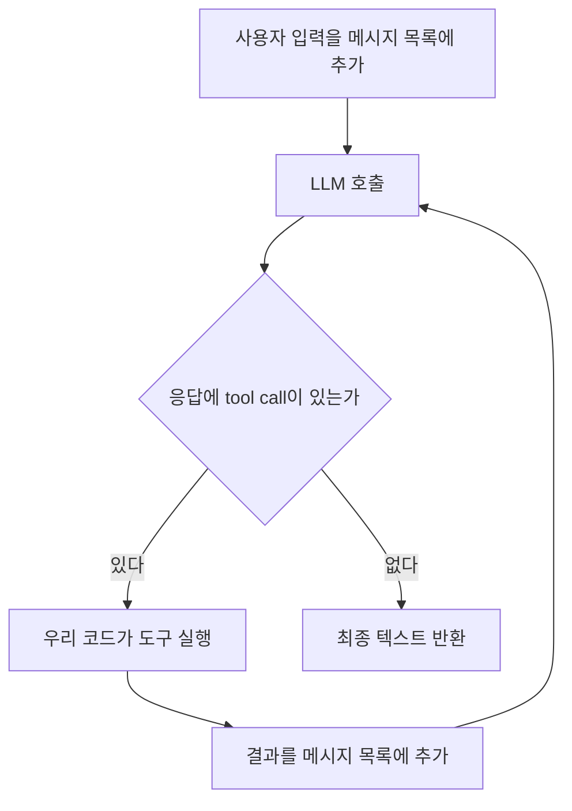

# Agents

## 1. Overview

원문: https://mastra.ai/docs/agents/overview

### 1-1. 에이전트란 무엇인가

문서의 정의는 이렇다. "LLM과 도구를 써서 열린 문제를 푼다. 목표를 놓고 추론해서 어떤 도구를 쓸지 정한다. 대화 기억을 유지하고, 모델이 최종 답을 내놓거나 정지 조건에 걸릴 때까지 반복한다."

#### 에이전트 루프

LLM API 호출 한 번은 "메시지 목록을 넣으면 텍스트 한 덩어리가 나온다"로 끝난다. 모델 자체는 파일을 읽거나 외부 API를 부를 수 없다. 그래서 모델에게 사용할 수 있는 함수 목록을 알려 주고, 모델이 "이 함수를 이 인자로 호출하고 싶다"는 응답을 내놓으면 우리 코드가 대신 실행해서 결과를 메시지 목록에 넣고 모델을 다시 호출한다. 모델이 함수 호출 없이 일반 텍스트로 답할 때까지 이 과정을 반복하는 것이 에이전트 루프이고, 모델이 함수 호출 의사를 표현하는 규약이 tool calling이다.

Claude Code가 이 루프 그대로다. Bash나 WebFetch 호출이 tool call이고, 그 결과가 다시 모델 입력으로 들어가 다음 판단을 한다. Mastra의 `Agent` 클래스는 이 루프를 직접 짜지 않아도 되게 감싼 것이다.

문서 정의의 각 구절은 루프의 요소와 대응한다.

- "어떤 도구를 쓸지 정한다": 모델이 tool call을 내놓는 판단
- "대화 기억을 유지한다": 루프를 돌 때마다 메시지 목록이 누적된다는 뜻
- "정지 조건": 무한 루프를 막는 장치. 최대 반복 횟수(`maxSteps`) 같은 값

#### 언제 에이전트를 쓰는가

문서는 "단계를 미리 알 수 없는 열린 작업에는 agent, 순서가 정해진 다단계 처리에는 workflow"라고 구분한다. 구분의 본질은 제어 흐름을 누가 정하는가다.

| | Agent | Workflow |
|---|---|---|
| 다음 단계를 정하는 주체 | 모델 | 개발자가 코드로 |
| 실행 경로 | 호출마다 달라질 수 있다 | 항상 같다 |
| 적합한 일 | "이 문서에서 근거를 찾아 답해라" | "PDF를 받아 추출, 청킹, 임베딩 순으로 처리해라" |

모델에게 순서를 맡기면 호출 횟수만큼 비용과 지연이 늘고 결과도 호출마다 흔들리기 때문에, 순서가 이미 정해진 일은 코드로 고정하는 편이 낫다. clap-agent에서 사용자 질문에 답하는 것은 agent이고, 정해진 주기로 평가를 돌리는 것은 workflow(`src/mastra/workflows/scheduled-evals-workflow.ts`)인 것이 이 기준 때문이다.

### 1-2. Quickstart: 첫 에이전트 만들기

#### 필수 속성

| 속성 | 뜻 | 일반 개념 |
|---|---|---|
| `id` | 코드에서 에이전트를 찾는 키 | `getAgentById`의 인자 |
| `name` | 사람이 읽는 표시 이름 | Studio와 트레이스에 표시 |
| `instructions` | 역할·성격·규칙을 적은 문장 | system prompt. 매 호출마다 메시지 목록 맨 앞에 들어간다 |
| `model` | `provider/모델명` 문자열 | model router가 해석해 provider의 API 키를 찾는다 |

#### 등록

`new Agent()` 직후의 객체는 자기 설정만 갖고 있다. `new Mastra({ agents })`를 거치면 `addAgent`가 logger, storage, 다른 에이전트 목록을 주입한다. (`@mastra/core/dist/mastra-*.js`의 `addAgent`) 주입은 객체를 직접 수정하므로, `Mastra`를 만드는 코드가 실행되지 않는 별도 스크립트에서만 주입 없이 "홀로 동작"한다.

| 메서드 | 찾는 기준 |
|---|---|
| `getAgent(key)` | 등록할 때 쓴 객체 키 (`todoAgent`) |
| `getAgentById(id)` | `Agent`의 `id` (`todo-agent`) |

#### 실습 결과

- `src/mastra/agents/todo-agent.ts`: 할 일 관리 에이전트. clap-agent 관례대로 id·키는 `constants.ts`, 모델 문자열은 `models.ts`, system prompt는 `todo-agent.prompt.ts`로 분리했다. 검사 도구는 biome(`npm run check`)과 tsc(`npm run typecheck`)다.
- Google이 새 사용자에게 `gemini-2.5-flash`를 막아서 `gemini-3.6-flash`로 바꿨다. 오류 문구는 Mastra가 아니라 provider가 돌려준 것이다.
- Studio를 다시 열면 대화 목록이 사라진다. Memory와 storage가 없어 in-memory 저장소로 동작하기 때문이다. (8·9회차)

#### clap-agent

- 생성: `src/mastra/agents/clap-agent.ts:94`. `instructions`와 `model`은 본체와 실험용 변형이 공유하는 설정 객체에 있다. (`:66`)
- `instructions`는 함수다. (`:72`) 요청마다 `requestContext`를 받아 대화 맥락 블록을 덧붙인다. 정본 프롬프트는 `clap-agent.prompt.ts:4`.
- `model`은 폴백 배열이다. (`:23`) Anthropic 실패 시 OpenAI로 넘어간다. 모델 문자열은 `models.ts`에 상수로 두고 `satisfies Record<string, RegisteredModelId>`로 오타를 막는다.
- 등록: `src/mastra/index.ts:81-82`. storage, logger, observability가 함께 넘어간다.
- 조회: 서버 라우트와 도구는 `getAgentById` (`server/review-thread-get.ts:43`, `tools/generate-report-tool.ts:66`), 평가 스크립트는 `getAgent(CLAP_AGENT_KEY)` (`evals/tool-calls-evals.ts:44`). 상수는 `constants.ts:3-4`.
- `name`은 상수로 빼지 않는다. id·키는 22곳에서 참조되지만 name은 생성자 한 곳뿐이다.

### 1-3. 에이전트 호출하기

#### generate와 stream

| 메서드 | 돌려주는 것 | 쓰는 자리 |
|---|---|---|
| `generate(입력)` | 루프가 끝난 뒤 완성된 결과 객체 | 배치, 평가, 도구 안에서 다른 에이전트 호출 |
| `stream(입력)` | 토큰이 나오는 대로 읽는 스트림 | 채팅 UI. Studio도 이걸 쓴다 |

`generate` 결과에서 자주 쓰는 필드는 `text`, `toolCalls`, `toolResults`, `steps`, `usage`다. `stream`은 `textStream`을 `for await`로 읽고, `usage` 같은 합계는 스트림이 끝난 뒤 Promise로 받는다.

고르는 주체는 호출하는 코드다. Mastra 서버는 에이전트마다 `/api/agents/:agentId/generate`와 `/stream` 엔드포인트를 자동으로 연다.

#### 실습 결과

- `scripts/call-todo-agent.ts`, 실행은 `npm run call` (`tsx --env-file=.env`). tsx를 쓰는 이유는 확장자 없는 import를 Node가 직접 실행하지 못하기 때문이다.
- `steps: 1`. 도구가 없어 루프가 한 바퀴만 돌았다.
- `usage.reasoningTokens`가 답변 토큰보다 훨씬 크다. Gemini 3.6 Flash는 답하기 전에 추론하는 모델이고, 무료 한도에도 포함된다.
- TypeScript 6.0부터 `types` 기본값이 빈 배열이라 `@types/node`를 설치해도 `process`를 못 찾는다. tsconfig에 `"types": ["node"]`를 명시했다. (https://devblogs.microsoft.com/typescript/announcing-typescript-6-0/)

#### clap-agent

- 직접 `generate`를 부르는 곳은 리포트 렌더링 한 군데다. `src/mastra/tools/report/render-html-report.ts:51` 완성된 HTML 전체가 필요해서 `stream`이 아니다.
- 그 보조 에이전트는 등록하지 않고 파일 안에서 만든 객체를 직접 쓴다. (`:33-38`) 메모리도 storage도 필요 없는 일회성 변환기라 공유 자원이 없어도 된다. 모델은 싼 `OPENAI_GPT_MINI`.
- 모델 출력은 `sanitizeHtml`로 정리한다. (`:55-68`) 코드펜스 제거와 XSS 방지를 코드로 강제한다.
- `stream` 호출은 코드에 없다. 프론트엔드가 서버 엔드포인트를 직접 부른다. 평가는 `runEvals`에 에이전트를 `target`으로 넘긴다. (`evals/safety-evals.ts:33`)
