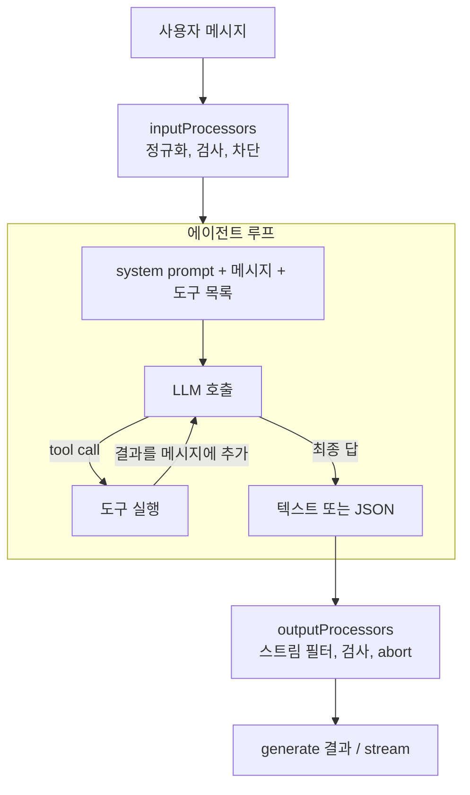
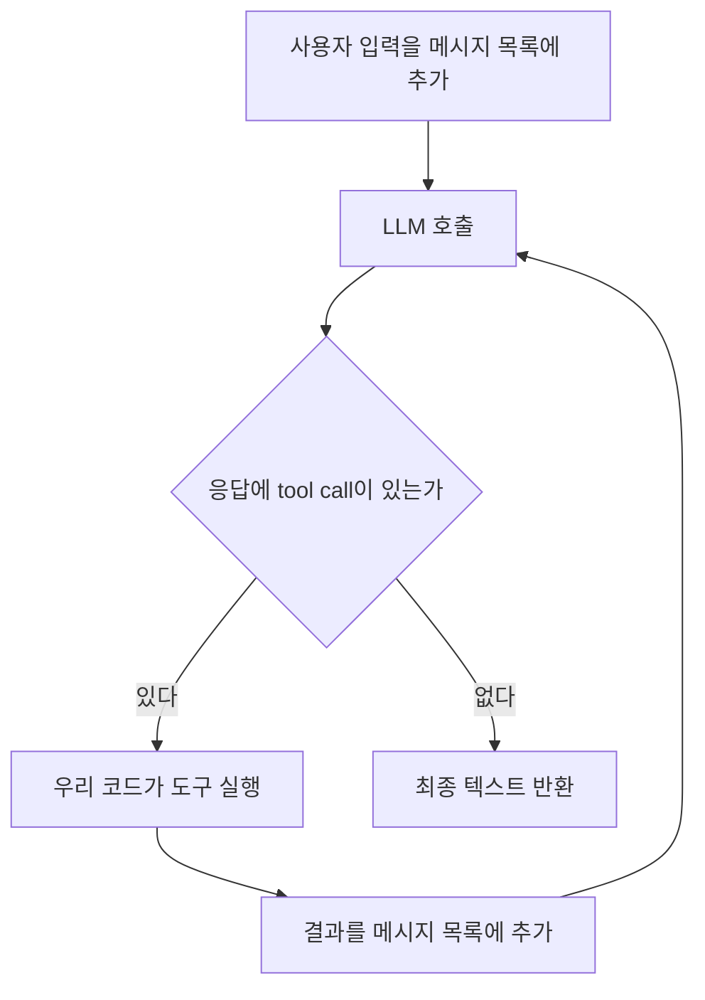
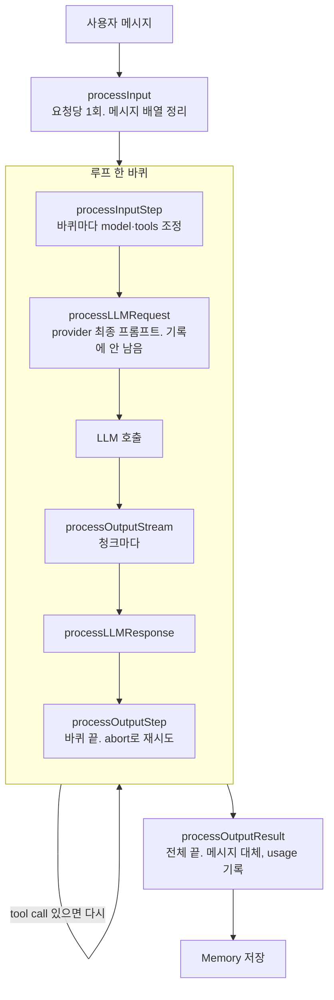

# Agents

Mastra 공식 문서 Build / Agents 절을 소제목 단위로 읽고 할 일 관리 에이전트 하나에 기능을 붙여 가며 정리한 기록이다. 소제목마다 개념, 실습 결과, clap-agent 비교, 헷갈렸던 지점(실제로 되물은 질문과 답) 순서다. 채팅에서 설명한 내용은 전부 여기에 남기고, 노션 발표 자료는 이 파일에서 핵심만 뽑은 것이다.

## 전체 흐름

이 절의 페이지 전부가 요청 한 건의 흐름 위의 한 지점씩에 해당한다.



| 지점 | 문서 페이지 | 핵심 |
|---|---|---|
| 루프 전체, 호출 | Overview | `Agent` 생성·등록, `generate`·`stream` |
| 도구 목록, 도구 실행 | Tools | `createTool`, 모델이 보는 이름은 객체 키 |
| 최종 답이 JSON | Structured Output | `structuredOutput.schema`, `errorStrategy` |
| 루프 앞뒤 | Processors | 훅 시점별 역할, `abort`와 tripwire |
| 검사 내용물 | Guardrails | 내장 검사기, `strategy` |
| 도구 실행 전 승인 | Human-in-the-Loop | `requireApproval`, approve / decline |
| 도구 호출 여러 번을 코드 한 번으로 | Code Mode | 모델이 쓴 코드를 샌드박스에서 실행 |

## 1. Overview

원문: https://mastra.ai/docs/agents/overview

건너뛴 소제목: Expand your agent(다른 페이지 링크 표), Multi-agent systems(별도 가이드 문서).

### 1-1. 에이전트란 무엇인가

#### 개념

문서의 정의는 이렇다. "LLM과 도구를 써서 열린 문제를 푼다. 목표를 놓고 추론해서 어떤 도구를 쓸지 정한다. 대화 기억을 유지하고, 모델이 최종 답을 내놓거나 정지 조건에 걸릴 때까지 반복한다."

LLM API 호출 한 번은 "메시지 목록을 넣으면 텍스트 한 덩어리가 나온다"로 끝난다. 모델 자체는 파일을 읽거나 외부 API를 부를 수 없다. 그래서 모델에게 사용할 수 있는 함수 목록을 알려 주고, 모델이 "이 함수를 이 인자로 호출하고 싶다"는 응답을 내놓으면 우리 코드가 대신 실행해서 결과를 메시지 목록에 넣고 모델을 다시 호출한다. 모델이 함수 호출 없이 일반 텍스트로 답할 때까지 이 과정을 반복하는 것이 에이전트 루프이고, 모델이 함수 호출 의사를 표현하는 규약이 tool calling이다.



Claude Code가 이 루프 그대로다. Bash나 WebFetch 호출이 tool call이고, 그 결과가 다시 모델 입력으로 들어가 다음 판단을 한다. Mastra의 `Agent` 클래스는 이 루프를 직접 짜지 않아도 되게 감싼 것이다.

문서 정의의 각 구절은 루프의 요소와 대응한다.

- "어떤 도구를 쓸지 정한다": 모델이 tool call을 내놓는 판단
- "대화 기억을 유지한다": 루프를 돌 때마다 메시지 목록이 누적된다는 뜻
- "정지 조건": 무한 루프를 막는 장치. 최대 반복 횟수(`maxSteps`) 같은 값

문서는 "단계를 미리 알 수 없는 열린 작업에는 agent, 순서가 정해진 다단계 처리에는 workflow"라고 구분한다. 구분의 본질은 제어 흐름을 누가 정하는가다.

| | Agent | Workflow |
|---|---|---|
| 다음 단계를 정하는 주체 | 모델 | 개발자가 코드로 |
| 실행 경로 | 호출마다 달라질 수 있다 | 항상 같다 |
| 적합한 일 | "이 문서에서 근거를 찾아 답해라" | "PDF를 받아 추출, 청킹, 임베딩 순으로 처리해라" |

모델에게 순서를 맡기면 호출 횟수만큼 비용과 지연이 늘고 결과도 호출마다 흔들리기 때문에, 순서가 이미 정해진 일은 코드로 고정하는 편이 낫다.

#### clap-agent

- 사용자 질문에 답하는 것은 agent이고, 정해진 주기로 평가를 돌리는 것은 workflow(`src/mastra/workflows/scheduled-evals-workflow.ts`)다.

### 1-2. Quickstart: 첫 에이전트 만들기

#### 개념

| 속성 | 뜻 | 일반 개념 |
|---|---|---|
| `id` | 코드에서 에이전트를 찾는 키 | `getAgentById`의 인자 |
| `name` | 사람이 읽는 표시 이름 | Studio와 트레이스에 표시 |
| `instructions` | 역할·성격·규칙을 적은 문장 | system prompt |
| `model` | `provider/모델명` 문자열 | model router |

instructions는 system prompt다. LLM 메시지에는 역할이 있다. `user`는 사용자 발화, `assistant`는 모델 응답, `system`은 대화 전체에 걸친 지시다. system 메시지는 매 호출마다 메시지 목록 맨 앞에 들어가므로, 루프가 몇 바퀴를 돌든 모델은 항상 이 지시를 보고 판단한다. Claude Code의 시스템 프롬프트와 `CLAUDE.md`가 이 자리다.

model 문자열은 model router가 해석한다. `google/gemini-3.6-flash`를 보고 `GOOGLE_API_KEY`를 찾아 Google API 형식으로 요청을 만든다. provider별 SDK를 import 하지 않아도 되고, 문자열만 바꾸면 provider가 바뀐다. 한 프로젝트에서 여러 provider를 섞어 쓸 수 있고(`.env`에 키를 나란히), 에이전트마다 다른 모델을 쓰거나 호출 시점에 바꿀 수도 있다. `create-mastra`의 `--llm` 옵션은 예제와 `.env` 항목만 정하는 것이지 프로젝트를 한 provider에 묶지 않는다.

만든 에이전트는 Mastra 인스턴스에 등록한다. `new Agent()` 직후의 객체는 자기 설정만 갖고 있다. `new Mastra({ agents })`를 거치면 `addAgent`가 logger, storage, 다른 에이전트 목록, tts, vectors를 주입한다. (`@mastra/core/dist/mastra-*.js`의 `addAgent`) 스프링에서 `@Component`로 등록한 빈만 다른 빈을 주입받는 것과 같은 구조다. 주입은 객체를 직접 수정하므로, `Mastra`를 만드는 코드가 실행되지 않는 별도 스크립트에서만 주입 없이 "홀로 동작"한다. `Mastra` 인스턴스가 이미 만들어졌다면 import 한 객체도 같은 객체라 주입된 상태다.

| 경로 | 결과 |
|---|---|
| `mastra.getAgentById('x')` | 주입이 끝난 에이전트. 대화 기록이 storage에 저장되고 로그가 공용 로거로 나간다 |
| 에이전트 파일만 import 해서 `x.generate()` | `Mastra` 인스턴스가 만들어진 적이 없으면 주입이 없다. 호출은 되지만 저장·로깅이 없다 |

| 메서드 | 찾는 기준 |
|---|---|
| `getAgent(key)` | 등록할 때 쓴 객체 키 (`todoAgent`) |
| `getAgentById(id)` | `Agent`의 `id` (`todo-agent`) |

#### TypeScript 문법 (Java 대응)

| TypeScript | Java 대응 | 설명 |
|---|---|---|
| `import { Agent } from '@mastra/core/agent'` | `import com.x.Agent;` | 모듈 경로 문자열. 중괄호 안이 가져올 이름 |
| `export const todoAgent = ...` | `public static final Agent todoAgent = ...` | `const`는 재할당 불가, `export`는 다른 파일에 공개 |
| `new Agent({ id: 'x', name: 'y' })` | builder로 값을 채운 생성자 | 중괄호는 객체 리터럴. `키: 값`을 나열하며 이름 있는 인자처럼 쓴다 |
| `{ todoAgent }` | `Map.of("todoAgent", todoAgent)` | 키와 변수명이 같으면 한 번만 쓰는 축약 |
| `{ [TODO_AGENT_KEY]: todoAgent }` | `map.put(TODO_AGENT_KEY, todoAgent)` | 계산된 키. 대괄호 안 변수 값이 키가 된다 |
| `'...'` 와 `` `...` `` | `"..."` 와 텍스트 블록 `"""` | 작은따옴표는 한 줄, 백틱은 여러 줄. 백틱 안 `${}`는 변수 삽입 |
| `as const satisfies Record<string, T>` | 없음 | `as const`는 값을 리터럴 타입으로 고정, `satisfies`는 타입에 맞는지만 검사하고 타입을 바꾸지 않는다. 모델명 오타가 컴파일에서 잡힌다 |
| `{ [P in Provider]: ... }[Provider]` | 없음 | 매핑 타입. provider마다 `provider/모델명` 타입을 만들어 합친 것. "Mastra가 아는 모델명만 허용하는 타입" |

클래스 하나가 파일 하나일 필요가 없고, 파일 안의 변수를 `export`로 내보낸다. 세미콜론은 biome 설정에 따라 붙인다.

#### 실습 결과

- `src/mastra/agents/todo-agent.ts`: 할 일 관리 에이전트. clap-agent 관례대로 id·키는 `constants.ts`, 모델 문자열은 `models.ts`, system prompt는 `todo-agent.prompt.ts`로 분리했다. 검사 도구는 biome(`npm run check`, clap-agent의 `biome.json` 복사)과 tsc(`npm run typecheck`)다. biome은 JS·TS용 포매터 겸 린터로 Prettier와 ESLint를 합친 것이고, Java의 spotless와 checkstyle에 해당한다. 서식(2칸, 100자, 작은따옴표), 미사용 import·변수, `import type`, `any`·`console`·`enum`·`!` 금지, `node:` 접두사를 강제한다.
- `name`은 상수로 빼지 않는다. 여러 곳에서 참조하는 값만 상수로 뺀다. clap-agent에서 id·키는 테스트 제외 22곳에서 쓰이지만 name은 생성자 한 곳뿐이다.
- Google이 새 사용자에게 `gemini-2.5-flash`를 막아서 `gemini-3.6-flash`로 바꿨다. 오류 문구는 Mastra가 아니라 provider가 돌려준 것이다. model router 목록에 있어도 provider 정책으로 막힐 수 있다.
- Studio를 다시 열면 대화 목록이 사라진다. Memory와 storage가 없어 in-memory 저장소로 동작하기 때문이다. (8·9회차)
- API 키: Google AI Studio 무료 티어(Flash 계열 무료. 한도는 프로젝트 단위, 분당 요청·분당 토큰·하루 요청 세 축, 넘으면 429. https://aistudio.google.com/rate-limit). Claude Pro 구독은 API와 별도 결제다.

#### clap-agent

- 생성: `src/mastra/agents/clap-agent.ts:94`. `instructions`와 `model`은 본체와 실험용 변형이 공유하는 설정 객체에 있다. (`:66`)
- `instructions`는 함수다. (`:72`) 요청마다 `requestContext`를 받아 대화 맥락 블록을 덧붙인다. 정본 프롬프트는 `clap-agent.prompt.ts:4`이고, 백틱 하나로 수십 줄을 담고 마크다운 헤더로 구역을 나눈다. 프롬프트 여러 개는 배열로 모아 `.join('\n\n')`으로 붙인다. (`:54-57`)
- `model`은 폴백 배열이다. (`:23`) Anthropic 실패 시 OpenAI로 넘어간다. 여러 provider를 함께 쓰는 실제 사례다. 모델 문자열은 `models.ts:5`에 상수로 둔다.
- 등록: `src/mastra/index.ts:81-82`. storage, logger, observability가 함께 넘어간다.
- 조회: 서버 라우트와 도구는 `getAgentById` (`server/review-thread-get.ts:43`, `tools/generate-report-tool.ts:66`), 평가 스크립트는 `getAgent(CLAP_AGENT_KEY)` (`evals/tool-calls-evals.ts:44`). 상수는 `constants.ts:3-4`.

#### 헷갈렸던 지점

- "import 해서 직접 쓰면 홀로 동작한다"는 무슨 뜻인가 → 위 두 경로 표.
- `name`은 왜 상수로 안 빼나 → 여러 곳에서 참조하는 값만 상수로 뺀다.
- 골격은 누가 만드나 → import·구조·주석은 AI가, 프롬프트 문장처럼 판단이 드는 자리는 사용자가 `TODO`를 채운다.
- 여러 provider를 쓸 수 있나 → 된다.
- biome이 뭔가 → 위 실습 결과.

### 1-3. 에이전트 호출하기

#### 개념

| 메서드 | 돌려주는 것 | 쓰는 자리 |
|---|---|---|
| `generate(입력)` | 루프가 끝난 뒤 완성된 결과 객체 | 배치, 평가, 도구 안에서 다른 에이전트 호출 |
| `stream(입력)` | 토큰이 나오는 대로 읽는 스트림 | 채팅 UI. Studio도 이걸 쓴다 |

`generate` 결과에서 자주 쓰는 필드는 `text`, `toolCalls`, `toolResults`, `steps`(루프 한 바퀴마다의 기록), `usage`다. `stream`은 `textStream`을 `for await`로 읽고, `usage` 같은 합계는 스트림이 끝난 뒤 Promise로 받는다.

고르는 주체는 호출하는 코드다. 설정이 아니다. Mastra 서버는 에이전트마다 `/api/agents/:agentId/generate`와 `/stream` 엔드포인트를 자동으로 열고, Studio 채팅은 `/stream`을 부른다.

에이전트를 부르는 자리는 셋이다.

| 자리 | 누가 부르나 | 예 |
|---|---|---|
| Mastra 서버 엔드포인트 | Mastra가 대신. 프론트엔드는 HTTP만 | 채팅 UI |
| 우리 API 라우트나 서비스 코드 | 우리 코드가 직접 `agent.generate()` | 배치, 분류 API |
| 도구·워크플로·스크립트 안 | 우리 코드가 직접 | 보조 에이전트 호출, 평가 |

#### TypeScript 문법 (Java 대응)

| TypeScript | Java | 뜻 |
|---|---|---|
| `Promise<T>` | `CompletableFuture<T>` | 나중에 값이 채워지는 상자 |
| `await 상자` | `future.get()` | 값이 채워질 때까지 기다렸다가 꺼낸다. 단 스레드를 막지 않고 그 함수만 멈춘다 |
| `async function` | 반환 타입이 `CompletableFuture`인 메서드 | 안에서 `await`를 쓸 수 있는 함수 |
| `for await (const x of 스트림)` | 도착을 기다리는 `while (it.hasNext())` | 항목이 도착할 때마다 하나씩 꺼낸다 |

모듈 최상위에서 `await`를 바로 쓸 수 있는 것은 ES 모듈(`"type": "module"`)이기 때문이다. `agent.generate(...)` 앞에 `await`가 붙는 이유는 `Promise<결과>`를 돌려주기 때문이고, 없이 받으면 결과가 아니라 상자를 받는다. `stream.usage`가 Promise인 이유는 스트림은 합계를 끝나야 알 수 있기 때문이고, `for await` 루프가 끝난 뒤 `await stream.usage`로 꺼낸다. `process.stdout.write`는 줄바꿈 없는 출력이라 토큰을 한 줄에 이어 붙일 때 쓴다.

#### 실습 결과

- `scripts/call-todo-agent.ts`, 실행은 `npm run call` (`tsx --env-file=.env`). tsx를 쓰는 이유는 확장자 없는 import를 Node가 직접 실행하지 못하기 때문이다(clap-agent도 devDependency). `--env-file`은 Node가 `.env`를 읽는 옵션이고, `mastra dev`는 알아서 읽지만 스크립트는 지정해야 한다. 스크립트는 `scripts/`에 둔다. biome이 그 폴더만 `console`을 허용한다.
- `steps: 1`. 도구가 없어 루프가 한 바퀴만 돌았다.
- `usage.reasoningTokens`가 답변 토큰보다 훨씬 크다(45 대 327). Gemini 3.6 Flash는 답하기 전에 추론하는 모델이고, 무료 한도에도 포함된다. `usage.raw`는 provider 원본이고 위쪽 필드는 Mastra가 정규화한 것이라 provider를 바꿔도 같은 이름으로 읽는다.
- TypeScript 6.0부터 `types` 기본값이 빈 배열이라 `@types/node`를 설치해도 `process`를 못 찾는다. tsconfig에 `"types": ["node"]`를 명시하고 `include`에 `scripts/**/*`를 추가했다. (https://devblogs.microsoft.com/typescript/announcing-typescript-6-0/) clap-agent는 소스가 `node:url` 같은 모듈을 직접 import 해서 타입이 따라 들어오므로 명시하지 않아도 됐다.

#### clap-agent

- 직접 `generate`를 부르는 곳은 리포트 렌더링 한 군데다. `src/mastra/tools/report/render-html-report.ts:51` 완성된 HTML 전체가 필요해서 `stream`이 아니다.
- 그 보조 에이전트는 등록하지 않고 파일 안에서 만든 객체를 직접 쓴다. (`:33-38`) 메모리도 storage도 필요 없는 일회성 변환기라 공유 자원이 없어도 된다. 모델은 싼 `OPENAI_GPT_MINI`. 역할이 단순한 보조 호출에는 작은 모델을 쓰는 관례다.
- 모델 출력은 `sanitizeHtml`로 정리한다. (`:55-68`) 코드펜스 제거와 XSS 방지를 코드로 강제한다. 모델 출력을 그대로 믿지 않는다는 원칙이다.
- `stream` 호출은 코드에 없다. 프론트엔드가 서버 엔드포인트를 직접 부른다. 평가는 `runEvals`에 에이전트를 `target`으로 넘긴다. (`evals/safety-evals.ts:33`) 자체 라우트(`server/api-routes.ts`)는 대화 기록 조회 같은 부가 기능이고 에이전트를 부르지 않는다.

#### 헷갈렸던 지점

- `generate`와 `stream`은 어디서 고르나 → 설정이 아니라 부르는 코드가 둘 중 하나를 호출한다.
- `await`가 뭔가 → Promise에서 값을 꺼내는 것. 스레드를 막지 않는다.
- stream 블록 코드가 이해가 안 간다 → `await agent.stream()`으로 읽을 준비가 된 스트림 객체를 받고, `for await`가 토큰이 도착할 때마다 `chunk`에 넣어 출력하는 것을 끝날 때까지 반복한다. `generate`는 이 전체를 한 번에 기다렸다가 완성된 `text`를 주는 것이고, `stream`은 도착 순서대로 우리가 직접 꺼내는 것이다.
- `await stream.usage` 줄은 왜 있나 → generate와 stream이 같은 정보를 다른 시점에 준다는 것을 보려던 것. 필수는 아니다.
- 왜 스크립트로 실습하나 → 호출 옵션을 붙일 수 있는 가장 짧은 경로. 채팅 제품은 엔드포인트가 대신 부르지만 배치·분류·평가는 이 형태다.

## 2. Tools

원문: https://mastra.ai/docs/agents/tools

건너뛴 소제목: When to use tools(자명), Valibot·ArkType(zod만 씀), Agents/Workflows as tools(별도 문서 범위. clap-agent가 `agents:`를 쓰긴 하므로 이름만 기억), Share tools·Streaming hooks·Control tool selection·Built-in tools(레퍼런스로 충분. `askUserTool`은 Human-in-the-Loop에서), Run logic around tool calls(clap-agent 미사용, 차단은 Guardrails에서).

### 2-1. 도구 정의와 에이전트 연결

#### 개념

tool calling에서 "함수 목록의 항목 하나"가 `createTool`이다.

| 필드 | 모델이 보는가 | 역할 |
|---|---|---|
| `id` | 아니오 | 트레이스·로그·CLI에서 도구를 가리키는 식별자 |
| `description` | 예 | 모델이 "언제 이 도구를 쓸지" 판단하는 근거 |
| `inputSchema` | 예 | 모델이 만들어야 할 인자의 형태. JSON Schema로 변환되어 전달된다 |
| `outputSchema` | 아니오 | 실행 결과 검증과 `execute` 반환 타입 추론 |
| `execute` | 아니오 | 우리 코드. `execute(inputData, context)` 한 가지 시그니처뿐이다 |

`context`에는 `requestContext`(요청별 데이터), `abortSignal`(취소), `mastra`(인스턴스)가 있고, 안 쓰면 생략한다. 도구 호출 한 번이 루프 한 바퀴다.

Mastra는 도구마다 아래 JSON을 만들어 LLM 요청에 실어 보낸다. `id`는 어디에도 없다.

```json
{
  "name": "listTodosTool",
  "description": "저장된 할 일 목록을 조회한다. 할 일이 뭔지, 남은 게 있는지 물으면 호출한다.",
  "parameters": {
    "type": "object",
    "properties": {
      "done": {
        "description": "생략 시 전체, true면 완료된 것만, false면 완료되지 않은 것만 보여준다.",
        "type": "boolean"
      }
    },
    "additionalProperties": false
  }
}
```

| 우리 코드 | JSON의 자리 |
|---|---|
| `tools: { listTodosTool }`의 키 | `name` |
| `createTool`의 `description` | `description` |
| `inputSchema` | `parameters` |
| `.describe('...')` | 필드의 `description` |
| `.optional()` | `required` 목록에서 빠짐 |

모델은 system prompt와 대화 외에 이 JSON 목록을 "지금 부를 수 있는 함수들"로 받는다. 어느 함수를 부를지는 `description`으로, 인자를 어떻게 채울지는 `parameters` 안의 `description`으로 판단한다.

도구 이름은 id가 아니라 객체 키다. `tools`는 `Map<String, Tool>`이고 키가 모델에게 보이는 함수 이름이다. `id`는 도구 객체 안의 필드일 뿐이다. `id`는 `mastra.getToolById`, CLI(`mastra api tool execute weather-tool`), 트레이스가 쓰고, 키는 "이 에이전트 안에서의 이름"이라 같은 도구를 에이전트마다 다른 이름으로 붙일 수 있게 분리되어 있다. 일부러 다르게 할 필요는 없고 관례를 하나로 정한다.

| 관례 | 코드 | 모델이 보는 이름 |
|---|---|---|
| 변수명을 키로 | `tools: { weatherTool }` | `weatherTool` (clap-agent 방식) |
| id를 키로 | `tools: { [weatherTool.id]: weatherTool }` | `weather-tool` |

우리는 키는 변수명(camelCase), `id`는 kebab-case로 두고, system prompt에서는 키 이름으로 언급한다.

#### zod

TypeScript 타입은 실행 시점에 사라진다. Java의 `Todo` 클래스는 컴파일 뒤에도 존재해 Jackson이 JSON을 검증하며 바꾸지만, `type Todo = { title: string }`은 컴파일러 검사에만 쓰이고 실행되는 JavaScript에는 흔적이 없다. 그래서 밖에서 들어온 JSON(모델이 만든 인자)이 정말 그 형태인지 실행 중에 확인할 방법이 언어 자체에는 없다.

zod 스키마는 값이라 실행 중에도 남는다. `todoSchema.parse(값)`으로 검증하고(안 맞으면 예외), `z.infer<typeof todoSchema>`로 컴파일 시점 타입을 뽑는다. 정의 하나로 JSON Schema 생성, 런타임 검증, 타입 추론 셋을 다 만든다. zod 없이 하려면 셋을 따로 쓰고 서로 어긋나지 않게 관리해야 한다. 그래서 Mastra가 zod를 기본으로 채택했다.

| | Java | TypeScript + zod |
|---|---|---|
| 타입 정의 | `class Todo` | `todoSchema` |
| 실행 중 검증 | Jackson + Bean Validation | `todoSchema.parse(값)` |
| 컴파일 시 타입 | `Todo` | `z.infer<typeof todoSchema>` |
| 정의 방향 | 클래스를 먼저, 검증 애노테이션을 붙임 | 검증 규칙을 먼저, 거기서 타입을 뽑음 |

`z`는 zod 라이브러리의 진입점이다. `z.string()`, `z.string().min(1)`, `z.number().int().positive()`, `z.boolean().optional()`, `z.object({...})`, `z.array(스키마)`, `.describe('...')`(모델에게 보이는 필드 설명)가 자주 쓰인다. 도구 인자 흐름은 이렇다. `inputSchema`를 JSON Schema로 바꿔 모델에게 보냄 → 모델이 JSON을 만듦 → `inputSchema.parse`로 검증 → 통과하면 `execute`에 타입 붙은 값으로, 실패하면 `execute`를 부르지 않고 모델에게 오류를 돌려줌.

#### TypeScript 문법 (Java 대응)

| 코드 | Java 대응 | 설명 |
|---|---|---|
| `type Todo = z.infer<typeof todoSchema>` | DTO 클래스 자체 | 스키마에서 타입을 뽑아 둘을 따로 관리하지 않음 |
| `async ({ title }) => addTodo(title)` | `input -> addTodo(input.getTitle())` | 화살표 함수. 인자 자리의 `{ title }`은 구조 분해 |
| `done?: boolean` | `Optional<Boolean>` | 생략 가능한 파라미터. 생략하면 `undefined` |
| `[...todos]` | `new ArrayList<>(todos)` | 배열 복사. 내부 배열을 밖에 그대로 주지 않기 위해 |
| 백틱 여러 줄 문자열 | 텍스트 블록 | 들여쓰기도 문자열에 들어가므로 줄 맨 앞에서 시작. `${`를 글자로 쓰려면 `\${` |

#### 실습 결과

- `src/mastra/todo/todo.schema.ts`(스키마와 타입), `src/mastra/todo/todo-store.ts`(메모리 배열. `mastra dev`가 파일 변경으로 다시 읽으면 비워진다), `src/mastra/tools/add-todo-tool.ts`, `src/mastra/tools/list-todos-tool.ts`.
- description은 "무엇을 하는지 → 언제 부르는지" 순서로 쓴다. 예시 발화만 나열하면 다른 표현에 약하다. `listTodosTool`의 `done` describe에는 생략·true·false의 뜻을 적었다. `title`의 "그대로"는 모델이 요약하거나 다듬는 것을 막는다.
- Studio에서 추가·조회 요청 모두 도구 호출 카드가 보였다. 카드를 펼치면 모델이 만든 인자와 `execute` 결과 JSON이 있고, Observability 탭의 트레이스에서 LLM 호출·도구 실행 span과 모델에게 보낸 도구 목록을 볼 수 있다. 코드로 보려면 `result.toolCalls`, `toolResults`, `steps.length`를 찍는다. 1-3에서 도구 없이 "추가한 척"하던 것과의 차이가 tool calling이다.

#### clap-agent

- 도구 36개가 `src/mastra/tools/` 아래 파일 하나에 하나씩. 파일명과 `id`가 kebab-case로 일치한다. 에이전트에 붙이는 레코드는 `agents/clap-agent.tools.ts`에 따로 모았고, 파일 맨 위 주석이 "키(camelCase)가 toolName이다 (kebab tool id 아님)"라는 함정을 적어 두었다.
- 에이전트에서는 `tools: () => ({ ...clapAgentTools, ... })`처럼 함수로 넘긴다. `agents/clap-agent.ts:85-88` 환경 변수에 따라 유무가 갈리는 코드 모드 도구를 실행 시점에 합치기 위해서다.
- `createTool`을 직접 쓰지 않고 `createClapTool` 팩토리로 감싼다. `src/mastra/tools/clap-tool-factory.ts:69-` `execute`가 던진 `ClapApiError`를 `{ error: true, status, guidance }` 객체로 바꿔 모델에게 결과로 준다. `guidance`는 상태 코드별 행동 지시(`:22-34`)이고, 예외 원문 대신 "같은 인자로 재시도하지 말고 ID를 다시 찾아라" 같은 지시를 주어야 모델이 복구한다는 경험(PR #229)에서 나왔다.
- 예상한 실패(`ClapApiError`)만 에러 객체로 바꾸고 그 외 예외는 다시 던진다. `:83-85` 에러 객체로 바꾸면 span이 성공으로 닫히므로 로거에 따로 남긴다. `:86-93`
- `execute`의 둘째 인자에서 `requestContext`를 꺼내 인증과 기본값에 쓰고, `requestContextSchema`로 그 형태까지 선언한다. `get-review-group-tool.ts:32-35`
- 도구가 예외를 던지면 지금 core(1.65.0)는 `TOOL_EXECUTION_FAILED`로 감싸 던지고(`utils-*.js`. 원래 예외 메시지가 그대로 실린다), 루프는 그 오류를 `tool-error` 청크와 `output-error` 상태의 도구 호출로 기록한 뒤 이어진다(`agent-*.js`). clap-agent 주석은 "스트림 전체가 끊긴다"고 하는데 당시 버전(`^1.52.1`) 차이일 수 있어, 실제로 `throw`를 넣어 확인하는 것이 확실하다. 어느 쪽이든 예외 원문보다 행동 지시가 담긴 결과 객체가 모델 복구에 낫고, 내부 URL·스택이 모델에게 실리지 않는다.

| | 예외 그대로 | 에러 객체로 반환 |
|---|---|---|
| 모델이 받는 것 | 예외 메시지 원문 | 상태 코드 + 다음 행동 지시 |
| 정보 노출 | 내부 URL·스택이 실릴 수 있음 | 담고 싶은 것만 |
| 트레이스 | 실패 span | 성공 span (에러는 결과 안에) |

#### 헷갈렸던 지점

- 키와 id가 뭐가 다른가 → 키는 모델이 보는 함수 이름, id는 우리가 트레이스·CLI에서 쓰는 식별자. 모델은 id를 본 적이 없다.
- 굳이 다르게 할 필요가 있나 → 없다. 관례를 하나로 정한다.
- `describe`는 모델에게 어떻게 보이나 → JSON Schema `parameters`의 필드 `description`.
- `z`는 뭔가 → zod 진입점. 스키마 생성 함수 묶음.
- zod가 뭔지 왜 쓰는지 → 실행 시점에 남는 타입 정의. 검증·JSON Schema·타입을 한 정의로.
- `done`이 뭔가 → 조회 도구의 필터 인자. 생략·true·false를 describe에 적어야 모델이 판단한다.
- 여러 줄 문자열은 어떻게 → 백틱.
- 결과가 잘 호출됐는지 어떻게 보나 → Studio 카드, Observability 트레이스, `result.toolCalls`.

### 2-2. 스키마와 description 작성

2-1에서 대부분 다뤘으므로 코드 추가로 대체했다. 지침은 세 줄이다.

- `description`: 무엇을 하는지 → 언제 부르는지 → 비슷한 도구와의 구분. 도구별 안내는 description에, 도구 횡단 정책만 system prompt에 둔다. 도구가 서너 개면 어떻게 써도 맞추지만 수십 개가 되면 비슷한 도구 사이에서 description이 유일한 판단 근거다.
- 필드 `describe`: 값의 의미, 형식, 생략 시 동작, 어디서 얻는 값인지. 타입 반복("문자열이다")은 적지 않는다. 필드 이름은 `reviewGroupId`처럼 무엇의 id인지 드러나게.
- `outputSchema`: 반환 형태가 여럿이면 union으로 선언한다. 검증에 실패하면 결과가 대체되기 때문이다.

#### 실습 결과

- `src/mastra/tools/complete-todo-tool.ts`. 없는 id면 예외 대신 `{ error: true, guidance }`를 돌려주고 `outputSchema`를 `z.union([todoNotFoundSchema, todoSchema])`로 선언했다. description은 "무엇을 → 언제 → id를 모르면 listTodosTool 먼저" 순서이고, `id`의 describe에 "listTodosTool 결과의 id 값"으로 어디서 얻는 값인지 적었다. `guidance`는 "같은 id로 재시도하지 말고 목록을 조회해 실제 id로"처럼 다음 행동을 지시한다.

#### TypeScript 문법 (Java 대응)

- `true as const`: `{ error: true }`의 타입은 `{ error: boolean }`으로 넓혀진다(`Boolean error = true`의 타입이 `Boolean`인 것과 같다). `z.literal(true)`는 값 `true` 하나뿐인 타입이라 `boolean`을 대입할 수 없다. `as const`를 붙이면 리터럴 타입으로 고정된다. `z.boolean()`이 아니라 `z.literal(true)`인 이유는 `{ error: false, guidance }` 같은 "에러가 아닌 에러 객체"를 타입에서 배제하고, `error` 필드 유무로 두 경우를 구분하기 위해서다.
- 합 타입 `A | B`: A 또는 B. Java에는 직접 대응이 없고(공통 인터페이스, `Object` + `instanceof`, sealed interface로 흉내), TypeScript는 관계없는 두 타입을 그 자리에서 묶는다. `'error' in result`처럼 필드 유무를 검사하면 블록 안에서 타입이 자동으로 좁혀진다(타입 좁히기). `execute`가 분기마다 다른 형태를 돌려주면 반환 타입이 합 타입이 되고 `outputSchema`의 union과 맞아야 컴파일된다.
- `'...' + '...'`: 긴 문자열을 두 줄로 나눈 것. biome 100자 제한 때문.

#### union 순서

`z.object`는 스키마에 없는 키를 조용히 버리고, `z.union`은 앞에서부터 시도해 처음 통과한 결과를 쓴다. 정상 스키마의 필드가 전부 optional이면 에러 객체가 정상 스키마에 먼저 매칭되어 `{}`로 잘린다. 직접 돌려 확인했다.

```typescript
const normalSchema = z.object({ title: z.string().optional() });
const errorSchema = z.object({ error: z.literal(true), guidance: z.string() });
const errorResult = { error: true, guidance: '목록을 다시 조회하라' };
z.union([normalSchema, errorSchema]).parse(errorResult); // {}
z.union([errorSchema, normalSchema]).parse(errorResult); // { error: true, guidance: '...' }
```

정상 객체는 `error: true`가 없어 에러 스키마에 매칭될 수 없으므로 에러 스키마를 앞에 두면 어느 쪽도 잘리지 않는다. 우리 `todoSchema`는 필드가 모두 필수라 순서가 문제되지 않지만 관례를 맞춰 앞에 뒀다.

#### clap-agent

- 팩토리가 `z.union([clapApiToolErrorSchema, opts.outputSchema])`로 에러 스키마를 앞에 둔다. `clap-tool-factory.ts:96-99` 이유가 주석에 있다. 에러 스키마는 `error: z.literal(true)`다. `:10`
- description은 "현재 대화의 리뷰 그룹 정보를 조회한다. … 사용자가 '리뷰 이름'처럼 요청하면 호출한다" 순서다. `get-review-group-tool.ts:17-18` 필드마다 `.describe('조회할 리뷰 그룹 ID (생략 시 현재 대화의 리뷰 그룹)')`. API 응답 스키마는 `src/types/schemas/`에 생성해 두고 `.omit`, `.extend`로 가공한다.

#### 헷갈렸던 지점

- `true as const`는 뭔가 → `true`가 `boolean`으로 넓혀지므로 리터럴로 고정.
- 합 타입은 뭔가 → `A | B`. `'error' in result`로 좁힌다.
- 잘될 때는 todoSchema, 에러면 notFound를 쓴다는 것인가 → 맞다. clap-agent도 팩토리가 같은 일을 한다.
- union 순서가 왜 중요한가 → 위 실험.
- 도구가 예외를 던지면 어떻게 되나 → 2-1 clap-agent 항목.

### 2-3. 도구 결과가 컨텍스트를 차지하는 문제

도구 결과는 통째로 메시지 목록에 들어가 루프가 도는 내내 토큰을 차지한다.

| 방식 | 모델이 보는 것 | 앱이 받는 것 | 화면·기록 |
|---|---|---|---|
| `execute`에서 줄임 | 줄인 것 | 줄인 것 | 줄인 것 |
| `toModelOutput` | 줄인 것 | 원본 | 원본 |
| `transform` | 원본 | 원본 | 가린 것 |

`toModelOutput`은 결과를 UI에도 써야 해서 원본이 필요할 때, `transform`은 민감한 값을 화면과 대화 기록에서 가릴 때 쓴다. 결과를 모델 외에 쓸 곳이 없으면 `execute`에서 줄이는 것이 가장 단순하다.

```typescript
// toModelOutput: 앱에는 전체 배열, 모델에게는 한 줄 텍스트
toModelOutput: (todos) => ({
  type: 'content',
  value: [{ type: 'text', text: todos.map((t) => `${t.id}. [${t.done ? 'x' : ' '}] ${t.title}`).join('\n') }],
}),

// transform: 모델과 앱은 원본, 화면과 기록에서만 제목을 가림
transform: {
  display: { output: (todos) => todos.map((t) => ({ ...t, title: '***' })) },
  transcript: { output: (todos) => todos.map((t) => ({ ...t, title: '***' })) },
},
```

#### clap-agent

- 둘 다 쓰지 않고 `execute`에서 줄인다. 응답 대부분을 차지하는 작성자 정보를 축약 유저로 바꾸고, 모델이 보면 안 되는 `available`은 뺀다. `get-review-group-tool.ts:50-58` 컨텍스트를 줄이는 것뿐 아니라 모델이 보면 안 되는 값을 빼는 용도로도 쓴다(권한을 스스로 판단하면 오히려 잘못 막는다).
- 프론트엔드가 도구 결과 원본을 쓰지 않으므로 `toModelOutput`이 필요 없고, 민감 값은 트레이스 단계의 `SensitiveDataFilter`(`src/mastra/index.ts:104-110`)로 가리므로 도구별 `transform`이 필요 없다. (추정) 설치된 core에도 `toModelOutput`이 있으므로 못 쓰는 것이 아니라 안 쓰는 것이다.

## 3. Structured Output

원문: https://mastra.ai/docs/agents/structured-output

건너뛴 소제목: Valibot·ArkType·JSON Schema(zod만 씀), Stream structured output·`useAgent`·`prepareStep`(필요할 때 레퍼런스로 충분).

### 3-1. 응답을 객체로 받기

#### 개념

모델의 답은 기본적으로 자유 텍스트다. 그 안에서 값을 코드로 꺼내려면 정규식으로 파싱하거나 "JSON으로만 답해"라고 부탁해야 하는데, 둘 다 형식이 조금만 어긋나도 깨진다. structured output은 답의 형태를 API 수준에서 고정한다. 요청에 JSON Schema를 실어 보내면(OpenAI `response_format`, Gemini `responseSchema`, Anthropic은 도구 호출 이용) provider가 디코딩 단계에서 제약을 걸어 프롬프트 부탁보다 훨씬 안정적이다. 우리 코드는 텍스트 대신 파싱되고 검증된 객체를 받는다.

tool calling과 같은 기술의 다른 용도다.

| | tool calling | structured output |
|---|---|---|
| 모델이 JSON을 만드는 목적 | 함수 인자 | 최종 답 |
| JSON을 받는 쪽 | 우리 코드가 실행하고 결과를 모델에게 돌려줌 | 우리 코드가 그대로 씀. 루프 끝 |
| 스키마 자리 | 도구의 `inputSchema` | `structuredOutput.schema` |

```typescript
const response = await agent.generate('오늘 남은 할 일을 정리해 줘', {
  structuredOutput: { schema: daySummarySchema },
});
response.object; // 스키마에서 추론된 타입. text도 함께 온다
```

호출 옵션으로 넘기거나, 에이전트의 `defaultOptions.structuredOutput`에 두어 모든 호출에 적용한다. 스키마는 루프의 매 LLM 호출에 붙는다. 도구를 부른 바퀴에서는 JSON 답이 안 나오고, 도구 결과를 받은 바퀴에서 나온다.

#### 실제 쓰임

공통점은 답을 사람이 읽지 않고 다음 코드가 소비한다는 것이다. UI 바인딩, 다른 API 전달, DB 저장.

```typescript
// 1. 화면에 구조대로 그리기 (clap-agent 사내규정 에이전트)
const { object } = await policyAgent.generate(question); // { answer, citations }
// <Answer text={object.answer} /> <CitationList items={object.citations} />  ← 인용을 링크로 그리려면 필드로 분리되어야

// 2. 분류해서 코드로 분기. z.enum이라 오타난 카테고리가 들어올 수 없다
schema: z.object({ category: z.enum(['billing', 'bug', 'feature', 'other']), priority: z.enum(['low', 'medium', 'high']), needsHuman: z.boolean() })
if (object.needsHuman) await assignToAgent(ticket, object.priority); else await autoReply(ticket, object.category);

// 3. 자유 텍스트에서 필드 뽑기 → DB 저장
schema: z.object({ title: z.string(), startsAt: z.string().describe('ISO 8601'), location: z.string().nullable(), attendees: z.array(z.string()) })
await calendarRepository.save(object);

// 4. LLM 채점 (10회차 Evals). 숫자로 받아야 임계값 비교와 집계가 된다
schema: z.object({ score: z.number().min(0).max(1), reason: z.string() })
if (object.score < 0.7) console.warn(object.reason);
```

우리 할 일 에이전트로 치면 "내일 오전 회의 준비"를 `{ title, dueDate }`로 받아 저장하는 것이고, 지금은 `addTodoTool`의 인자로 같은 일을 하고 있다. 반대로 사람이 그대로 읽는 채팅 답변에는 쓰지 않는다. 문장이 JSON 필드에 욱여넣어지고 스트리밍 경험이 사라진다.

#### 채팅 구조로 바꾸면

호출 코드가 사라지고 프론트엔드의 HTTP 요청이 된다. 스키마는 에이전트 쪽으로 옮긴다.

```typescript
// src/mastra/agents/todo-agent.ts
defaultOptions: { structuredOutput: { schema: daySummarySchema } },  // 모든 호출에 적용

// 프론트엔드
const res = await fetch('http://localhost:4111/api/agents/todo-agent/generate', {
  method: 'POST', headers: { 'Content-Type': 'application/json' },
  body: JSON.stringify({ messages: [{ role: 'user', content: '오늘 남은 할 일을 정리해 줘' }] }),
});
const { object, text } = await res.json();
```

스트리밍이면 `/stream`을 부르고 `object-result` 청크에서 객체를 꺼낸다. 요청마다 스키마를 바꾸려면 본문에 `structuredOutput`을 실어 보낼 수 있다(서버 코드에서 확인). HTTP로 넘어가므로 zod가 아니라 JSON Schema(`z.toJSONSchema(스키마)`)를 보낸다.

```
프론트엔드 → POST /api/agents/todo-agent/generate { messages }
  → Mastra 서버 → agent.generate(messages, defaultOptions 적용)
  → LLM 호출 (system prompt + 대화 + 도구 목록 + responseSchema)
  → tool call: listTodosTool → execute → 결과 붙여 재호출 (responseSchema 유지)
  → {"summary":..,"remaining":[..],"top":..} → daySummarySchema.parse 검증
  → { text, object, steps: 2, usage } → JSON 응답 → renderSummary(object)
```

`defaultOptions`에 걸면 "안녕"이라는 인사에도 그 형태로 답해야 한다. 대화도 하고 요약도 하는 에이전트라면 요약 전용 에이전트를 따로 두거나 요약 화면에서만 스키마를 실어 보낸다. clap-agent가 사내규정 에이전트(항상 구조화)와 Clap Agent(항상 텍스트)를 별도 에이전트로 둔 것과 같은 판단이다.

#### 실습 결과

- `scripts/structured-output.ts`, 실행은 `npm run structured`. Studio 채팅창은 호출 옵션을 못 붙이므로 스크립트로 한다.
- `[object]`에 스키마 형태의 객체가, `[text]`에 모델이 만든 JSON 문자열이 왔다. `steps: 2`로 도구(`listTodosTool`)를 부른 뒤 JSON으로 답했다. Gemini 3.6 Flash는 도구와 structured output을 한 호출에서 같이 처리한다. 스크립트 프로세스의 저장소는 비어 있어 결과는 빈 목록이었다.

#### clap-agent

- 사내규정 에이전트(Policy Agent)가 `defaultOptions.structuredOutput`으로 항상 `{ answer, citations }`를 낸다. `src/mastra/agents/policy-agent.ts:31-37`, 스키마는 `policy-agent.schema.ts:10-13`이고 필드마다 `describe`가 있다. 프론트엔드가 인용을 별도 요소로 그린다.
- 호출 코드가 없다. 프론트엔드가 Mastra 서버 엔드포인트를 부르므로 호출 옵션을 넘길 자리가 없어 에이전트 기본값으로 걸었다. `object`를 소비하는 코드는 프론트엔드에 있어 이 컴퓨터에서 확인하지 못했다.
- 리뷰 질의응답 에이전트(Clap Agent)는 텍스트 답이라 쓰지 않는다. 같은 프로젝트 안에서도 "다음 코드가 소비하는가"로 갈린다.

#### 헷갈렸던 지점

- structured output 개념이 뭔가 → 답의 형태를 API 수준에서 고정. 모델은 JSON만 만들고 우리는 검증된 객체를 받는다.
- 왜 스크립트 형태로 실습하나 → `structuredOutput`은 에이전트 설정이 아니라 호출 옵션이라 Studio 채팅창에서는 못 붙인다. 실제로 쓰는 자리도 코드다.
- 실제로 어떤 식으로 쓰이나 → 위 네 가지 전형.
- 실제로도 `generate`를 호출해서 쓰나 → 에이전트를 부르는 자리는 셋. 채팅 제품은 서버 엔드포인트가 대신 부르고, 배치·분류·평가는 우리 코드가 직접.
- 채팅 구조로 바꾸면 코드가 어떻게 되나 → 위 "채팅 구조로 바꾸면".
- 에이전트가 항상 저 구조로 답한다는 것인가 → `defaultOptions`면 그렇다. 인사에도 JSON.

### 3-2. 도구와 함께 쓸 때의 제약

#### 개념

LLM 요청 한 번에 `tools`("필요하면 이 함수를 불러라")와 `responseSchema`("최종 답은 이 JSON으로 써라")가 같이 실린다. 일부 모델 API는 둘이 같이 들어오면 거절한다. "함수를 부를 수도 있는 요청인데 답 형식을 JSON으로 고정한다고? 지원 안 함"이라는 것이다. Gemini 2.5가 그랬고 오류는 `Function calling with a response mime type: 'application/json' is unsupported`다. 3.6 Flash는 거절하지 않았다(실습에서 `steps: 2`). 그래서 지금은 문제가 없고, 모델을 바꿨을 때를 대비한 우회책이다.

| 우회책 | 방법 | 비용 |
|---|---|---|
| `jsonPromptInjection: 'auto'` | `responseSchema` 파라미터를 빼고 "이 JSON 형태로 답하라"는 글을 메시지에 붙인다. `'auto'`면 Mastra가 모델 능력표를 보고 native가 되면 native, 안 되면 프롬프트 방식 | 호출 수 그대로. "파라미터로 강제"가 아니라 "글로 부탁"이라 형식을 어길 가능성이 조금 있다 |
| `structuredOutput.model` | 본체가 도구를 쓰며 텍스트로 답하고, 둘째 모델이 그 텍스트를 JSON으로 바꾼다. 각 호출에 `tools`나 `responseSchema` 중 하나만 있어 거절되지 않는다 | LLM 호출 한 번 추가 |
| `prepareStep` | 루프 단계마다 옵션을 바꿔 첫 바퀴는 `tools`만, 뒤 바퀴는 `responseSchema`만 | 코드가 늘어난다. 잘 안 쓴다 |

native 지원이면 아무것도 안 하고, 불확실하면 `'auto'` 한 줄, 형식이 자주 깨지거나 답변 품질과 구조화를 분리하고 싶으면 `model`을 따로 둔다. 실습 없음.

#### clap-agent

- Anthropic·OpenAI 모델을 쓰고 우회 옵션 없이 `schema`만 둔다. `policy-agent.ts:33-36` 두 provider 모두 함께 지원한다.

#### 헷갈렸던 지점

- 뭔 소린지 모르겠다 → 요청 한 번에 "이 함수들을 부를 수 있다"와 "최종 답은 이 JSON으로"가 같이 들어가는데, 그 조합을 거절하는 API가 있다는 이야기. 우회책은 둘을 한 요청에 같이 넣지 않는 방법들.

### 3-3. 검증 실패 처리

#### 개념

모델이 만든 JSON이 스키마 검증에 실패했을 때(필드 누락, 배열 대신 문자열, JSON이 아닌 문장) Mastra가 무엇을 돌려줄지를 `errorStrategy`로 정한다.

| 값 | `object`에 오는 것 | 쓰는 경우 |
|---|---|---|
| `'strict'` (기본) | 아무것도 안 온다. 예외 | 결과를 코드가 받는 경우. 잘못된 객체로 다음 로직이 도는 것보다 실패가 낫다 |
| `'warn'` | 검증 안 된 값 그대로 + 경고 로그 | 형태가 조금 어긋나도 진행해야 하는 실험·로그 용도 |
| `'fallback'` | 미리 정한 `fallbackValue` | 결과를 사용자가 보는 경우. 빈 화면 대신 안내 문구 |

판단 기준은 하나다. 검증 실패를 누가 받는가. `fallbackValue`는 스키마 타입에 맞아야 하므로 스키마에 필드를 추가하고 빼먹으면 컴파일 오류다. `'fallback'`일 때만 필수이고 다른 전략에서는 `never`라 넣으면 컴파일 오류다. 타입이 두 갈래로 나뉘어 있다. `@mastra/core/dist/agent/types.d.ts:312-316` 지침의 "제약은 주석이 아니라 타입으로 강제한다"를 Mastra가 그대로 한 예다.

```
우리 코드 → Mastra: { schema, errorStrategy, fallbackValue }
Mastra → 모델: schema 만 (JSON Schema)          ← 모델은 errorStrategy·fallbackValue 를 모른다
모델 → Mastra: JSON 텍스트
Mastra: schema.parse
  통과 → object = 파싱 결과
  실패 → strict 예외 / warn 원본 + 경고 / fallback → object = fallbackValue
```

`jsonPromptInjection`은 이것과 다르다. 스키마를 어떤 방식으로 모델에게 전달할지를 정하므로 요청 쪽에 영향을 준다.

#### 실습 결과

- `scripts/structured-output.ts`에 `errorStrategy: 'fallback'`과 `fallbackValue`를 추가했다. `fallbackValue`에서 필드를 빼면 컴파일 오류가 난다. 실행은 생략했다.

#### clap-agent

- 사내규정 에이전트가 `'fallback'`이다. `policy-agent.ts:34-35` 대체 값은 "확인할 수 없다"는 안내와 빈 인용 목록이라 프론트엔드 인용 코드가 그대로 동작한다. 안내 문구는 모델이 근거를 못 찾았을 때의 문구 상수(`POLICY_UNVERIFIABLE_MESSAGE`)를 재사용해 둘을 하나로 맞췄다.

#### 헷갈렸던 지점

- 옵션을 전부 모델에게 전달하나 → `schema`만. 나머지는 응답이 돌아온 뒤 Mastra가 적용하는 규칙.
- 스키마대로 안 오면 Mastra가 적절한 처리를 한다는 것인가 → 맞다. 처리 내용을 우리가 옵션으로 미리 정하고 실행은 Mastra가 한다.
- `fallback`이 아니면 `fallbackValue`가 필요 없나 → 필요 없고, 넣으면 타입 오류.

## 4. Processors

원문: https://mastra.ai/docs/agents/processors

건너뛴 소제목: processInputStep·processLLMRequest/Response·prepareStep(단계별 모델 교체 같은 고급 용도), Response caching(beta), Advanced patterns(signals, custom stream events, metadata, workflows as processors), API error handling·ProviderHistoryCompat·ToolSearchProcessor(provider 호환 문제가 생길 때 레퍼런스로). Violation callbacks는 Guardrails에서.

### 4-1. 프로세서란 무엇이고 어디서 도는가

#### 개념

메시지가 모델로 들어가기 전과 나온 뒤에 끼어드는 훅이다. 스프링의 필터·인터셉터 자리다. 시점마다 훅이 있고, 한 프로세서 객체가 여러 훅을 같이 구현할 수 있다. 생각할 수 있는 모든 타이밍에 추가 로직을 넣을 수 있다는 것이 이 페이지의 핵심이다.



| 배열 | 언제 | 용도 |
|---|---|---|
| `inputProcessors` | LLM 호출 전 | 정규화, 인젝션 검사, 토큰 제한 |
| `outputProcessors` | 응답 중(스트림)과 후 | 출력 검사, 마스킹 |
| `errorProcessors` | LLM API 예외 시 | provider 오류 복구 |

- 배열 순서대로 돈다. `[정규화, 인젝션 검사, 모더레이션]`이면 정규화된 텍스트를 인젝션 검사가 본다. Memory 프로세서는 입력에서 우리 것보다 앞(기록을 불러옴), 출력에서 우리 것보다 뒤(저장)에 자동으로 붙는다. 그래서 출력에서 `abort`하면 저장이 건너뛰어진다.
- `generate`·`stream` 옵션으로 같은 배열을 넘기면 그 호출에서만 대체한다. 배열 대신 `requestContext`를 받는 함수를 넘겨 요청별로 다르게 할 수도 있다.
- Guardrails 페이지의 내장 프로세서도 전부 이 자리에 꽂힌다. Processors가 틀이고 Guardrails가 내용물이다.

| 훅 | 이번 회차 | clap-agent 사용 |
|---|---|---|
| `processInput` | 실습 | `requestContextLogger`, 가드레일 |
| `processInputStep` | 건너뜀 | 없음 |
| `processLLMRequest` | 개념만 | `anthropicMessagesCacheBreakpoint` |
| `processOutputStream` | 실습 | `garbledTextDetector` |
| `processLLMResponse` | 건너뜀 | 없음 |
| `processOutputStep` | 개념만 | 없음 |
| `processOutputResult` | 실습 | 가드레일, 시스템 프롬프트 스크러버 |
| `processAPIError` | 건너뜀 | 없음 |

#### 메시지 구조

메시지는 `message → content → parts[] → text` 세 겹이다. 한 메시지가 텍스트 한 덩어리가 아니기 때문이다. LLM API의 메시지는 처음에는 `{ role, content: "문자열" }`이었지만 지금은 한 메시지 안에 여러 조각이 들어간다. 2-1 실습의 두 턴을 그대로 옮기면 메시지 4개다. 카드와 답변이 따로가 아니라 에이전트 턴 하나가 메시지 하나이고 그 안에 조각이 둘이다.

```
[ // ① 사용자 턴: 조각 1개
  { id: 'm1', role: 'user', content: { parts: [ { type: 'text', text: '내일 오전 회의 준비를 할 일에 추가해 줘' } ] } },
  // ② 에이전트 턴: 조각 2개 (도구 호출 + 답변 텍스트)
  { id: 'm2', role: 'assistant', content: { parts: [
      { type: 'tool-invocation', toolInvocation: { toolName: 'addTodoTool', state: 'result', args: { title: '내일 오전 회의 준비' }, result: { id: 1, ... } } },
      { type: 'text', text: '내일 오전 회의 준비를 할 일에 추가했어요.' } ] } },
  // ③ 사용자 턴
  { id: 'm3', role: 'user', content: { parts: [ { type: 'text', text: '할 일 목록 보여 줘' } ] } },
  // ④ 에이전트 턴: 조각 2개
  { id: 'm4', role: 'assistant', content: { parts: [
      { type: 'tool-invocation', toolInvocation: { toolName: 'listTodosTool', state: 'result', args: {}, result: [ ... ] } },
      { type: 'text', text: '현재 할 일은 1개입니다. 1. 내일 오전 회의 준비' } ] } },
]
```

| 조각 종류 | 예 |
|---|---|
| `text` | 사용자 발화, 답변 |
| `file`·이미지 | 첨부 |
| `tool-invocation` | 도구 호출과 결과 |
| `reasoning` | 답하기 전 추론 |

| 겹 | 담는 것 | 누가 쓰나 |
|---|---|---|
| `message` | `id`, `role`, `createdAt`, `threadId` | 저장소(DB 행), 대화 기록 조회 |
| `content` | `parts`, `metadata`, 옛 형식용 `content` 문자열 | 프로세서, UI 변환 |
| `parts[]` | 조각들. 순서가 생성 순서 | 모델 입력 변환, 화면 렌더링(조각마다 카드) |

이 구조 덕분에 Studio가 ②의 조각을 순서대로 그려 도구 카드와 말풍선을 따로 보여 주고, ④를 만들 때 모델이 ①②③을 전부 받아 ②의 도구 조각으로 "아까 1번으로 추가했다"를 알고, `ToolCallFilter`처럼 도구 조각만 골라내는 일이 가능하다. `content: "문자열"`이면 셋 다 불가능하다. 이 구조는 Mastra가 아니라 Vercel AI SDK의 `UIMessage` 형식이고, `MastraDBMessage`는 그 형식을 DB에 저장하는 단위다. clap-agent는 저장된 메시지에서 텍스트를 꺼낼 때 `content?.parts ?? []`로 방어한다. `server/review-thread-messages.ts:64`

프로세서에 들어오는 배열은 사용자 메시지 한 건당 한 번, LLM 호출 직전에 Mastra가 우리 함수를 부르며 넘긴다. 우리가 부르는 것이 아니다. 돌려준 배열이 이후 단계의 messages가 된다.

| 방식 | 프론트엔드가 보내는 것 | 프로세서에 들어오는 것 |
|---|---|---|
| Memory 없음 (지금) | 새 메시지 하나 | `[③]` |
| Memory 있음 (clap-agent) | 새 메시지 + threadId. 서버가 저장소에서 이전 대화를 꺼내 붙임 | `[①, ②, ③]` |
| Memory 없이 프론트가 관리 | 대화 전부 | `[①, ②, ③]` |

세 경우 모두 LLM에는 "받은 배열 전부"가 간다. 모델은 그 배열이 대화 전체인지 하나인지 모르고 우리가 주는 만큼만 본다. 저장소가 없으면 "못 보내는" 것이 아니라 "보낼 이전 메시지가 없는" 것이다. 이전 메시지를 붙이려면 어딘가에 남아 있어야 하고, 그 어딘가가 저장소, 꺼내 붙이는 역할이 Memory다. 지금 Studio에서 둘째 턴에 목록이 나온 이유는 모델의 기억이 아니라 도구가 저장소 배열을 읽었기 때문이다. Memory를 붙이면 프로세서 코드는 바꿀 것이 없다. 배열을 돌면서 텍스트 조각만 손대도록 써 두었기 때문이다.

| 층 | 누가 정했나 |
|---|---|
| 메시지 목록을 매번 통째로 보낸다 | LLM API (상태를 기억하지 않는다) |
| 메시지 안이 `parts` 조각이다 | Vercel AI SDK |
| 루프 앞뒤에 프로세서를 끼운다, Memory가 앞뒤에 붙는다 | Mastra. 다른 프레임워크는 다르게 한다(LangChain은 체인 앞뒤 함수, Claude Agent SDK는 hook) |
| `normalize`에서 무엇을 할지 | 우리 |

#### TypeScript 문법 (Java 대응)

- `...`(spread): 객체·배열의 내용을 그 자리에 펼쳐 넣는다. `{ ...a, done: true }`는 `a`의 필드를 전부 복사한 뒤 `done`만 덮어쓴다. Java의 `a.toBuilder().done(true).build()`. 뒤에 오는 것이 앞을 덮어쓰고, 얕은 복사라 중첩 객체를 바꾸려면 안쪽에서 다시 `...`를 쓴다. 1-2의 `...clapAgentSharedConfig`, 2-1의 `[...todos]`도 같은 문법이다.
- `parts?.map(...)`: `parts`가 `undefined`면 `map`을 부르지 않고 `undefined`. Java의 `Optional.map`.
- `Processor & Required<Pick<Processor, 'processInput'>>`: `Processor`는 훅이 전부 optional인 인터페이스. `Pick`으로 `processInput`만 골라 `Required`로 필수로 바꾼 것을 `&`로 합쳐 "Processor이면서 processInput은 반드시 있는 것". Java로 치면 인터페이스를 구현하되 그 메서드를 꼭 오버라이드하겠다고 선언하는 것. 없어도 동작은 같고 메서드를 빠뜨리면 컴파일에서 잡는 용도. clap-agent 표기.
- `processInput: ({ messages }: ProcessInputArgs): MastraDBMessage[] => ...`: 필드에 화살표 함수를 넣는다. Java의 익명 클래스 메서드 구현. 인자 객체에서 `messages`만 구조 분해로 꺼내고 `abort`, `systemMessages`는 안 꺼낸다. 돌려준 배열이 원래 메시지를 대체한다.
- `messages.map((message) => ({ ... }))`: Java의 `stream().map().toList()`. 화살표 함수 본문이 `{`로 시작하면 코드 블록으로 읽히므로 객체를 바로 돌려주려면 괄호가 필요하다.
- `part.type === 'text' ? {...} : part`: 삼항. 조건 안에서만 TypeScript가 part를 텍스트 타입으로 좁혀 `part.text`에 접근할 수 있다.

프로세서 코드가 세 겹인 이유는 맨 안쪽 `text`를 바꾸려면 겹마다 "복사하고 그 필드만 바꾼다"를 반복해야 하기 때문이다. 원본을 `part.text = ...`로 직접 고치면 짧지만, 사본을 돌려주는 것이 관례다. 다른 프로세서나 Memory가 같은 객체를 보고 있을 수 있다. `normalize`는 문자열을 받아 문자열을 돌려주는 순수 함수라 위 구조를 신경 쓰지 않아도 된다.

#### 실습 결과

- `src/mastra/processors/input-normalizer.ts`(5-1에서 내장 `UnicodeNormalizer`로 교체해 지금은 없다. 골격·완성 커밋에 남아 있다). `processInput`으로 텍스트 조각만 NFC 정규화·공백 정리(`text.normalize('NFC').replace(/[ \t]+/g, ' ').trim()`). 줄바꿈은 합치지 않는다. LLM 없이 함수를 직접 불러 확인했다. `"  회의   준비\n  두 번째 줄  "` → `"회의 준비\n 두 번째 줄"`.
- 로직만 있는 실습이라 사용자가 직접 채우지 않고 AI가 채웠다.

#### clap-agent

- 입력 `[unicodeNormalizer, inputGuardrails, anthropicMessagesCacheBreakpoint]`, 출력 `[garbledTextDetector, outputGuardrails]`. `agents/clap-agent.ts:100-102` 정규화가 먼저 돌아야 가드레일이 정리된 텍스트를 보고, 캐시 마커는 마지막이어야 앞 변경까지 캐시 범위에 든다. 사내규정 에이전트는 대화 기록 정리 프로세서 하나만 둔다. `policy-agent.ts:39`
- 정규화는 내장 `UnicodeNormalizer`. `collapseWhitespace: false`에 "여러 줄 붙여넣기가 뭉개진다" 주석. `agents/clap-agent.processors.ts:57-64` 실습은 구조를 보려고 직접 짰고, 실무라면 내장을 쓴다.
- `requestContextLogger`는 메시지를 안 바꾸고 로그만 남기는 진단용 `processInput`. `:31-37` 프로세서를 "매 요청 시작 시점의 훅"으로 쓴 것. 도구를 안 부르는 응답에서도 요청 컨텍스트가 제대로 들어왔는지 확인한다.
- `anthropicMessagesCacheBreakpoint`는 `processLLMRequest`로 provider 요청에만 캐시 마커를 붙인다. 대화 기록에는 안 남는다. provider 호환 작업이 생기면 이 훅을 찾는다.

#### 헷갈렸던 지점

- `...`이 뭔가 → spread.
- 프로세서 코드를 자세히 → 위 문법 항목.
- 메시지 구조는 왜 그런가 → 조각이 섞이기 때문.
- 실제 대화 예시로 → 위 4개 메시지.
- 이 배열이 어디로 언제 들어오나 → 사용자 메시지 한 건당 한 번, LLM 호출 직전.
- Mastra 구조인가 → 위 "누가 정했나" 표.
- 메시지 목록을 매번 통째로 보내는데 왜 하나만 보이나 → 통째로 만드는 주체가 갈린다. 지금은 이전 메시지가 어디에도 없어 통째가 하나다.
- 저장소가 없으면 통째로 못 보내나 → 보낼 이전 메시지가 없는 것.
- 입력 훅은 하나인가 → 아니다. 시점마다 있다.

### 4-2. 출력 프로세서와 abort

#### 개념

| 훅 | 언제 | 받는 것 | 돌려주는 것 | 화면에 나가기 전인가 |
|---|---|---|---|---|
| `processOutputStream` | 청크마다 | 청크 하나(`part`) | 청크(통과), `null`(그 청크만 버림) | 예 |
| `processOutputStep` | 바퀴 끝 | 그 단계의 `text` | 없음. `abort(..., { retry: true })`로 재시도 | 아니오 |
| `processOutputResult` | 전체 끝 | 완성된 메시지 배열과 `result`(usage, steps) | 메시지 배열(대체) | 아니오 |

어느 훅을 고르느냐는 "사용자에게 이미 나갔는가"로 정한다. 스트리밍이면 청크는 나오는 즉시 클라이언트로 가므로 결과 시점 검사는 이미 늦다. 화면에 보이기 전에 막아야 하는 것(민감 정보, 깨진 문자)은 스트림 훅에서만 되고, 전체를 봐야 판단되는 것(품질, usage)은 결과 훅에서 한다. 결과 훅은 "사용자가 봤느냐"가 아니라 "대화 기록에 남느냐, 운영자가 아느냐"를 다루는 자리다.

| 방식 | 장점 | 단점 |
|---|---|---|
| 스트리밍 안 함 (`generate`) | 완전 차단 | 답이 다 될 때까지 화면이 빈 상태 |
| 스트리밍 + 청크 검사 | 즉시 표시 | 경계에 걸친 패턴 놓침, LLM 검사 불가 |
| 스트리밍 + 사후 검사 + 화면 교체 | 즉시 표시, 무거운 검사 | 잠깐 보였다 바뀜. 프론트엔드가 tripwire·커스텀 이벤트를 받아 교체 |

`abort(이유, 옵션)`는 tripwire다. 건드리면 경보가 울리는 철선이라는 뜻이고, 프로세서가 부르면 `TripWire` 예외로 실행이 끝나고 Memory 저장을 건너뛴다.

| 호출 방식 | 어디서 보나 |
|---|---|
| `stream` | `fullStream`에 `{ type: 'tripwire', payload: { processorId, reason } }` 청크 |
| `generate` | `result.tripwire`, `result.finishReason === 'other'` |

일반 예외는 "실패"라 오류 화면이지만 tripwire는 "정책에 의한 정상 종료"라 청크·필드로 전달되고 `processorId`·`reason`(과 `metadata`)으로 클라이언트가 분기한다. 프론트엔드는 이 청크를 받으면 지금까지 그린 말풍선을 "차단되었습니다"로 바꾸거나 지운다. `{ retry: true }`면 끝내는 대신 이유를 모델에게 보여 주고 재시도한다(`maxProcessorRetries` 필요). `state`는 프로세서 id별로 격리된 요청 단위 메모라, 스트림 훅에서 센 값을 결과 훅에서 읽는다. 스트림 훅은 청크마다 불리므로 "총 몇 번 걸렸다"를 그 안에서는 모른다.

메시지 metadata는 `content` 안 `parts` 옆의 자유 형식 꼬리표다. 우리 코드가 쓰고, 모델은 안 보고(LLM 요청에 안 실림), Memory에 메시지와 같이 저장되고, 클라이언트가 `uiMessages`·`finish` 청크로 받는다. 프로세서 판정 결과("청크 2개를 걸렀다"), 프론트엔드 표시("일부 내용이 가려졌습니다" 배지), 대화 기록 분석에 쓴다.

| 남기는 곳 | 누가 보나 | 남는 기간 |
|---|---|---|
| 로그 | 운영자 | 로그 보존 기간 |
| 메시지 metadata | 프론트엔드 + 대화 기록 조회 | 메시지와 함께 영구 |
| `abort` | 프론트엔드(tripwire) | 메시지가 저장되지 않으므로 기록에 없음 |

#### 실습 결과

- `src/mastra/processors/output-filter.ts`. 스트림 훅에서 내부 경로 패턴(`mastra.db`, `node_modules`)을 `***`로 가리고(청크를 버리면 문장이 끊기므로) `state.filtered`를 세며, 결과 훅에서 assistant 메시지 `metadata.filteredChunks`에 남긴다. LLM 없이 훅을 직접 불러 확인했다. `"파일은 mastra.db 에 있어요"` → `"파일은 *** 에 있어요"`, `state.filtered = 1`, metadata `{ filteredChunks: 1 }`.
- 훅은 `async`여야 한다. `Processor` 인터페이스가 Promise를 요구한다. 동기 함수로 썼다가 타입 오류가 났다. Java로 치면 인터페이스 메서드 시그니처가 `CompletableFuture<T>`인 것.
- `/$^/`는 아무것도 매칭하지 않는 정규식. 골격에서 패턴을 채우기 전 자리.
- 청크 단위로 걸리므로 단어가 청크 경계에 걸치면 안 걸릴 수 있다. 스트림 필터의 한계다.

#### clap-agent

- 스트림 훅은 검출만. `garbledTextDetector`가 깨진 문자(U+FFFD) 수를 세어 경고 로그를 남기고 통과시킨다. `state`에 횟수가 아니라 직전 청크의 꼬리 텍스트를 저장해 로그 문맥을 확보한다. 청크 하나에는 앞 문맥이 없어서 로그에 남길 때 꼬리를 붙여야 어디가 깨졌는지 보인다. `agents/clap-agent.processors.ts:74-95` 주석에 "제거로 바꾸려면 반드시 이 훅에서 해야 한다. `processOutputResult` 시점엔 델타가 이미 나간 뒤"라고 적혀 있다. 로그에 threadId·traceId는 공유 로거가 span 컨텍스트에서 자동으로 붙인다(10회차).
- LLM 가드레일은 사후 비동기 검사로 경고만 남긴다(fail-open). `:240`, `:265`
- 결과 훅은 내장 `SystemPromptScrubber`를 `redact`로 만들되 사본은 원본과 대조해 로그 스니펫을 만드는 데만 쓰고 원본을 그대로 돌려준다. `:102`, `:143` `warn` 전략은 로그 형식이 나빠 `redact`로 두고 직접 로그를 만든 것.
- 응답을 바꾸지 않고 즉시 표시를 택했다. 차단은 입력 가드레일에 맡긴다. 우리 실습은 metadata에 남겼고 clap-agent는 로그에 남긴다. 운영자가 보는 쪽을 택한 것.

#### 헷갈렸던 지점

- 청크마다 검사하고 다 왔을 때 검사하는 게 사용자 입장에서 무슨 의미인가, 다 왔을 때는 이미 늦은 것 아닌가 → 맞다. 막기는 스트림 훅에서만. 결과 훅은 기록·관측·저장 차단용.
- tripwire가 뭔가 → `abort()`가 만드는 "정책으로 차단됨" 신호.
- 스트림에서 이미 처리하는데 결과 훅은 왜 → 막는 일은 스트림에서 끝나고, 결과 훅은 총 몇 번 걸렸는지를 남기는 자리. 집계가 필요 없으면 빼도 된다.
- 메시지 metadata는 뭔가 → 위 표.

### 4-3. 내장 유틸 프로세서

| 프로세서 | 하는 일 | 자리 |
|---|---|---|
| `TokenLimiter(한도)` | 총 토큰이 한도를 넘으면 오래된 메시지부터 제거. system 보존 | `inputProcessors` |
| `ToolCallFilter` | 이전 대화의 도구 호출·결과 조각을 LLM 입력에서 제거. 저장본은 유지(화면의 카드는 남고 모델은 결과 텍스트만 봄). `preserveModelOutput: true`면 `toModelOutput` 결과만 남김 | `inputProcessors` |

Memory가 있어 대화가 쌓일 때 의미가 있다. 도구를 많이 쓰는 대화는 도구 조각(인자와 결과 전체)이 매 턴 그대로 넘어가 토큰 대부분을 차지한다. 실습은 8회차로 미룬다.

#### clap-agent

- 둘 다 안 쓴다. Memory `lastMessages: 20`으로 개수 단위 제한(`agents/clap-agent.ts:112`), 도구 조각 크기는 `execute`에서 줄인다.
- `ToolCallFilter`를 넣을 만한가 → 후보는 맞지만 실측이 필요하다. 후속 질문("그중 가장 낮은 사람은?")이 이전 턴 도구 결과에 의존하면 도구를 다시 불러야 하고(호출·지연 증가. 프롬프트 규칙 "수치는 도구 결과를 그대로 인용"과는 맞음), Anthropic 캐시 브레이크포인트와의 상호작용, `preserveModelOutput`이 `toModelOutput` 없이는 의미가 없다는 점이 걸린다. 입력 토큰 중 이전 턴 도구 조각 비율(트레이스 LLM span), 후속 질문 의존 빈도(평가 데이터셋), 켜고 끈 평가 비교(`filterAfterToolSteps` 절충 포함)가 근거다. 10회차에서 잴 수 있다.

## 5. Guardrails

원문: https://mastra.ai/docs/agents/guardrails

건너뛴 소제목: 각 프로세서의 상세 옵션(레퍼런스).

### 5-1. 내장 가드레일과 strategy

#### 개념

Processors가 틀이면 Guardrails는 그 틀에 넣는 내장 검사기다. LLM을 쓰는 것과 안 쓰는 것의 차이가 핵심이다. LLM 검사기는 요청마다 분류 호출이 하나 더 붙어 지연과 비용이 늘고, 그래서 작은 모델을 따로 지정한다.

| 프로세서 | 자리 | LLM | 하는 일 |
|---|---|---|---|
| `UnicodeNormalizer` | 입력 | 아니오 | 유니코드·공백 정리. 4-1에서 손으로 짠 것 |
| `PromptInjectionDetector` | 입력 | 예 | 인젝션·탈옥·시스템 오버라이드 분류 |
| `LanguageDetector` | 입력 | 예 | 언어 감지·번역 |
| `ModerationProcessor` | 입력·출력 | 예 | 혐오·폭력 등 분류 |
| `PIIDetector` | 입력·출력 | 예 | 이메일·전화·카드번호 검출·마스킹 |
| `SystemPromptScrubber` | 출력 | 예 | 새어 나온 시스템 프롬프트 제거 |
| `TokenCostControl` | 입력 | 아니오 | 누적 비용 한도. observability storage 필요 |
| `BatchPartsProcessor` | 출력 | 아니오 | 스트림 청크 묶기 |

`strategy`가 검출 뒤 행동을 정한다.

| 값 | 동작 | 요청은 |
|---|---|---|
| `block` | `abort()` → tripwire | 중단 |
| `warn` | 경고 로그 | 계속 |
| `detect` | 검출 결과만 기록 | 계속 |
| `redact` | 해당 부분 마스킹 | 계속 |
| `rewrite` | LLM이 안전한 문장으로 고쳐 씀 | 계속 |
| `translate` | 번역 | 계속 |

`block`만 요청을 끊고 나머지는 통과시키며 무언가를 남긴다. 프로세서마다 지원 전략이 다르다(`ModerationProcessor`는 `block | warn | filter`, `model` 필수). `onViolation`은 전략과 무관하게 걸릴 때마다 불리는 콜백이고 커스텀 프로세서에도 붙일 수 있다. 끊긴 요청은 `result.tripwire` 또는 `tripwire` 청크로 받는다.

#### 실습 결과

- `src/mastra/processors/guardrails.ts`. 4-1의 손 프로세서를 내장 `UnicodeNormalizer`(`stripControlChars`, `preserveEmojis`, `collapseWhitespace: false`, `trim`)로 교체하고, `ModerationProcessor`를 `model: GOOGLE_FLASH`, `categories: ['hate', 'harassment', 'violence']`, `threshold: 0.7`, `strategy: 'warn'`으로 붙였다. 순서는 정규화 → 모더레이션이다. warn으로 어떤 입력이 걸리는지 본 뒤 block으로 올리는 순서다. Studio 확인은 요청을 아끼려 생략했다(요청 하나에 분류 호출이 하나 더 붙는다).

#### clap-agent

- 분류 모델을 본체와 분리한다. `GUARDRAIL_MODEL = MODELS.OPENAI_GPT_NANO`. `agents/clap-agent.processors.ts:41` `includeScores: true`로 범주별 점수를 로그에 남겨 `threshold` 조정 근거로 쓴다. `:46` `lastMessageOnly: true`는 한 요청에 메시지가 여러 개일 때 마지막만 검사하는 비용 가드다. `:47-50`
- LLM 검사기는 전부 사후 비동기다. `inputGuardrails`·`outputGuardrails` 래퍼가 `detachChecks`로 검사를 백그라운드에 던지고 메시지를 즉시 돌려준다. `:236-250`, `:262-272` 지연은 0이지만 `abort`가 불가능해 전략은 `warn`뿐이다(fail-open). 차단이 필요해지면 그 검사만 인라인으로 옮긴다. `:53`, `:181` 사후 시점에는 트레이스가 닫혀 있어 스레드 id로 로그를 상관짓는다. `:267`
- 인젝션 검출기를 `rewrite`가 아니라 `warn`으로 둔 이유: 오탐이면 사용자 메시지가 통째로 버려진다. `:52`

| | mastra-playground | clap-agent |
|---|---|---|
| 분류 모델 | 본체와 같음 | 별도 경량 모델 |
| 실행 시점 | 인라인 (응답 전) | 사후 비동기 (응답 후) |
| 전략 | `warn` | `warn` (구조상 그것만 가능) |
| 차단 | 올리면 `block` 가능 | 인라인으로 옮겨야 가능 |

### 5-2. 가드레일 지연 줄이기

| 방법 | 내용 | 효과 |
|---|---|---|
| 작은 모델 | 검사기에 경량 모델 지정 | 호출당 지연·비용 감소 |
| 병렬 실행 | 독립인 `block` 검사기를 워크플로로 묶어 동시 실행 | 검사기 수만큼 늘던 지연이 하나 분으로 |
| 청크 배치 | `BatchPartsProcessor`를 출력 검사기 앞에 두어 청크를 묶음 | 스트림 검사 호출 횟수 감소 |

문서의 세 방법은 차단을 유지하면서 지연을 줄이는 것이고, clap-agent의 사후 비동기는 지연을 없애고 관측만 하는 것이다. 그 서비스에서 차단이 필수인지로 갈린다.

## 6. Human-in-the-Loop

원문: https://mastra.ai/docs/agents/human-in-the-loop

개념만 봤다. 실습은 스냅샷 storage가 필요해 9회차 Storage 뒤로 미룬다. 건너뛴 소제목: Supervisor agents(범위 밖), Resuming after a restart(`listSuspendedRuns`, storage 뒤에).

### 6-1. 도구 실행 전 승인

#### 개념

도구가 실행되기 전에 멈추고 사람의 승인을 기다린다. 삭제·결제·발송처럼 되돌릴 수 없는 행동, 비싼 외부 호출에 쓴다.

| 방법 | 어디에 | 언제 멈추나 | 재개 |
|---|---|---|---|
| `requireApproval: true` | 도구 정의(`createTool` 옵션) | `execute` 전. 모델이 인자까지 정한 상태 | `approveToolCall` / `declineToolCall({ reason })` |
| `requireToolApproval` | 호출 옵션 | 그 호출의 모든 도구. 함수면 조건부 | 같음 |
| `suspend()` | `execute` 안 | 실행 도중 추가 정보가 필요할 때 | `resumeStream(데이터)`. `autoResumeSuspendedTools`면 다음 메시지에서 `resumeSchema`에 맞는 값을 뽑아 자동 (Memory 필요) |

```
모델: completeTodoTool { id: 1 } 호출 결정
  → requireApproval 이면 실행하지 않고 멈춤
     stream  → 'tool-call-approval' 청크 { toolCallId, toolName, args }
     generate → finishReason: 'suspended', suspendPayload
  → 사람이 args 를 보고 결정
     approveToolCall({ runId }) → execute 실행 → 루프 계속
     declineToolCall({ runId, reason }) → reason 이 도구 결과 자리에 들어가 모델이 다른 답을 찾음
```

- 스냅샷 storage가 없으면 "snapshot not found"다. 지금 프로젝트는 in-memory라 실습이 안 된다.
- 승인은 사람이 본 `toolName + args` 지문에 묶고 `beforeToolCall` 훅에서 대조하는 것이 안전하다. 인자가 바뀌면 옛 승인으로 실행되지 않게.
- `askUserTool`이 `suspend()` 방식의 내장 도구다.

```typescript
// 도구 정의에 붙인다. 이 도구는 execute 전에 항상 멈춘다
export const completeTodoTool = createTool({
  id: 'complete-todo',
  // ...
  requireApproval: true,
  execute: async ({ id }) => { /* 승인되어야 실행 */ },
});

// 호출 쪽이 멈춤을 받아 승인·거절한다
const stream = await agent.stream('1번 끝냈어');
for await (const chunk of stream.fullStream) {
  if (chunk.type === 'tool-call-approval') {            // args 에 { id: 1 }
    const ok = await askHuman(chunk.payload.args);
    const next = ok
      ? await agent.approveToolCall({ runId: stream.runId })
      : await agent.declineToolCall({ runId: stream.runId, reason: '사용자가 취소함' });
    for await (const c of next.textStream) process.stdout.write(c);
  }
}

// 도구를 고치지 않고 호출 한 번에만 걸 때
await agent.stream('정리해 줘', { requireToolApproval: true });
await agent.stream('정리해 줘', { requireToolApproval: ({ toolName }) => toolName === 'completeTodoTool' });
```

#### clap-agent

- 쓰지 않는다. 도구가 전부 조회라 승인할 행동이 없다. 파일 삭제·셸 실행 도구가 있는 harness 템플릿에는 `requireApproval`이 기본으로 걸려 있었다.

#### 헷갈렸던 지점

- `requireApproval`은 어디에 있나 → `createTool` 옵션. 호출 옵션 `requireToolApproval`은 그 호출의 모든 도구(또는 함수로 조건부)에 건다.

## 7. Code Mode

원문: https://mastra.ai/docs/agents/code-mode (beta)

개념만 봤다. 건너뛴 소제목: Scoping tools across multiple code tools, Remote sandboxes 상세.

### 7-1. 모델이 쓴 코드를 실행하는 도구

#### 개념

람다와 비슷하다. 코드를 받아 격리된 환경에서 실행하고 결과를 돌려준다. 차이는 그 코드를 모델이 그 자리에서 쓴다는 것이다. 핵심은 "코드를 실행한다"가 아니라 모델이 내놓는 것이 도구 호출에서 프로그램으로 바뀐다는 점이다.

tool calling 규약 위에서 그대로 돌아간다. `createCodeMode()`가 만드는 `execute_typescript`는 인자 스키마가 `{ code: string }`인 도구 하나다. `addTodoTool`이 `title` 문자열을 받듯 이 도구는 `code` 문자열을 받고, 그 문자열의 내용이 소스 코드일 뿐이다. 모델 입장에서 `title`에 "회의 준비"를 써 넣는 것과 `code`에 프로그램을 써 넣는 것은 같은 행동이다. 그 도구의 `execute`(`createCodeMode`가 대신 짜 준 것)가 `code`를 샌드박스에서 실행하고 `return` 값을 도구 결과로 돌려준다.

모델이 코드를 쓸 수 있는 이유는 `createCodeMode`가 우리 도구들의 `inputSchema`·`outputSchema`를 TypeScript 타입 선언(`external_listTodosTool(input: { done?: boolean }): Promise<Todo[]>`)으로 바꿔 system prompt에 붙여 주기 때문이다. `createCodeMode({ tools })`에 넘긴 도구만 코드에서 부를 수 있다.

```
사용자: "미완료 할 일 전부 완료 처리해 줘"
  → LLM 호출. 도구 목록에 execute_typescript, system prompt에 external_* 타입 선언
  → 모델의 tool call: execute_typescript { code: "
        const todos = await external_listTodosTool({ done: false });
        await Promise.all(todos.map(t => external_completeTodoTool({ id: t.id })));
        return { completed: todos.length };" }     ← 모델이 이 자리에서 작성
  → Mastra가 code를 샌드박스에서 실행
        external_listTodosTool 호출 → 호스트의 listTodosTool.execute (검증·requestContext·트레이스 그대로)
        external_completeTodoTool ×N → 호스트의 completeTodoTool.execute
  → return 값 { completed: 3 } 만 도구 결과로 모델에게
  → 모델: "미완료 할 일 3개를 완료 처리했습니다."
```

| 얻는 것 | 이유 |
|---|---|
| 왕복 감소 | "상위 5개 상품의 평균 평점"이 일반 루프면 LLM 왕복 7번, 코드 모드면 1번 |
| 컨텍스트 감소 | 도구 원본 결과는 샌드박스 안에서 줄이고 return 값만 모델에게 |
| 정확한 계산 | 합계·평균이 토큰 예측이 아니라 JS로 |
| 병렬 | `Promise.all` |

| | 그냥 코드 실행 (셸 도구) | 코드 모드 |
|---|---|---|
| 모델이 쓰는 것 | 임의의 코드 | 우리 도구들을 조합하는 코드 |
| 코드가 접근할 수 있는 것 | 환경 전체 | `external_*` 함수뿐 (isolate 경계일 때) |
| 도구는 어디서 도나 | 해당 없음 | 호스트. 기존 도구 코드 그대로 |

한 번 부르고 끝나는 도구는 묶어도 이득이 없다. `createCodeMode`를 여러 번 부르면 도구 부분집합마다 별도 코드 도구가 생겨 최소 권한 범위를 나눌 수 있다.

#### 샌드박스

모델이 쓴 코드를 실행하므로 실행 경계를 반드시 고른다(`sandbox` 필수).

| | `LocalSandbox` | `IsolatedVmCodeModeTransport` | `QuickJsCodeModeTransport` | 원격(E2B) |
|---|---|---|---|---|
| 실행 위치 | 호스트 자식 `node` 프로세스. 코드를 임시 파일로 쓰고 실행 | 같은 프로세스 안 V8 isolate(크롬 탭처럼 힙·컨텍스트가 분리된 JS 실행 공간) | 같은 프로세스 안 WebAssembly QuickJS 엔진 | 별도 micro-VM |
| 코드가 접근할 수 있는 것 | 호스트 권한 전부 (파일, 네트워크, env의 API 키) | `external_*`뿐. `require`·`fs`·`fetch`·`process` 없음. 메모리 한도 | `external_*`뿐 | 그 VM 안 |
| 설치 부담 | 없음 | 네이티브 애드온 + Node 20 이상 `--no-node-snapshot` 플래그 | 없음 (순수 JS 패키지) | 외부 서비스, 전용 transport |
| 속도 | 빠름 | 빠름 | 느림 | 네트워크 왕복 |
| 쓰는 곳 | 로컬·신뢰 환경만. 인젝션으로 오염된 코드가 서버 권한을 얻는다 | 운영 기본 | 서버리스처럼 애드온을 못 깔거나 플래그를 못 줄 때 | 완전 분리, 무거운 계산, 패키지 설치 |

네이티브 애드온: Node 패키지 대부분은 JavaScript로만 되어 있어 `npm install`하면 어디서든 돈다. 네이티브 애드온은 C++로 짜서 컴파일한 바이너리(`.node`)를 Node에 붙이는 패키지다. 설치 시 플랫폼(OS·CPU·Node 버전)에 맞는 바이너리를 받거나, 없으면 빌드 도구(python, make, C++ 컴파일러)로 빌드한다. `isolated-vm`이 애드온인 이유는 V8 isolate 생성이 JS에서 접근할 수 없는 V8 내부 API라 C++로 직접 붙어야 하기 때문이다. 배포 이미지에 빌드 도구가 없거나 서버리스처럼 환경을 못 고르면 설치가 실패하고, Node 버전을 올리면 다시 빌드해야 한다. Java로 치면 JNI로 네이티브 라이브러리를 붙인 jar다. 예: `isolated-vm`, `bcrypt`, `sharp`, DuckDB.

#### clap-agent

- 쓴다. 도구 이름은 문서 기본값 `execute_typescript`이고 환경 변수로 켜고 끈다. `src/mastra/constants.ts:13`, `agents/clap-agent.code-mode.ts`
- 모든 도구를 넣지 않는다. 팬아웃·집계가 일어나는 조회 도구와 계산 도구만 넣는다. `CLAP_CODE_MODE_TOOLS` 주석: "툴 하나가 늘 때마다 입출력 타입 선언이 시스템 프롬프트에 붙는다. resolver는 한 번 부르고 끝나 이득이 없다."
- 프롬프트 충돌을 풀어야 했다. 본체 절대 규칙 "수치를 직접 계산하지 않는다"를 그대로 읽으면 모델이 코드 안 계산까지 얼어붙는다. 코드 모드 전용 지시로 "토큰 계산 금지 규칙이지 JS 계산에는 해당 없다. 인용할 통계는 `external_calculate_statistics`로(자릿수 규약)"를 덧붙인다. `CLAP_CODE_MODE_CALCULATION_INSTRUCTION` 팩토리 에러 객체를 정상 응답으로 읽으면 프로그램이 죽으므로 "`error === true`를 먼저 확인하라"도 덧붙인다. `:203-205`
- 코드 모드 도구는 플래그로 유무가 갈리므로 도구 레코드를 함수로 넘겨 실행 시점에 합친다. 2-1의 `tools: () => ({...})`의 이유.
- 샌드박스는 `LocalSandbox`를 직접 단단하게 만든 것이다. `:250-285`
  - 왜 isolate를 안 썼나: 배포 환경(Fargate) 커널이 네임스페이스 생성을 막아 `LocalSandbox`의 bwrap 격리도 불가(ECS exec 실측). 네이티브 애드온도 그 환경에서 부담.
  - Node permission model을 `NODE_OPTIONS`로 걸어 파일 읽기(프로그램 파일 제외)·쓰기·자식 프로세스 생성을 끊는다. `/proc/1/environ`으로 호스트 env가 새는 경로가 막힌다.
  - 네트워크는 permission model 밖이라 preload 스크립트(`clap-agent.code-mode.harden.ts`)가 허용 목록 밖 모듈 import를 전부 막는다. 차단 목록 방식은 `_http_client` 같은 레거시 모듈로 소켓이 뚫렸다(실측).
  - `CallLimitedTransport`가 `StdioCodeModeTransport`를 감싸 `external_*` 호출 횟수를 세고 상한(200)을 넘는 호출만 실패시켜 잘못 쓴 루프가 Clap API를 두들기지 못하게 한다. `:79-95` 계산 도구는 API를 안 치므로 세지 않는다.
  - 타임아웃 60초, 힙 128MB, 동시 실행 4. `constants.ts:16-27`
  - `StdioCodeModeTransport`가 프로그램을 `tmpdir()/mastra-code-mode-*`에 쓰는데 macOS의 tmpdir 심링크(`/var`→`/private/var`) 때문에 permission allowlist 밖에서 죽어, `TMPDIR`을 실경로로 고정한다. `:216-227`
- 새로 시작한다면 isolate나 QuickJS를 먼저 검토하는 것이 문서의 권고다. clap-agent는 "격리 샌드박스를 못 쓰는 환경에서 LocalSandbox를 운영 수준으로 끌어올린" 사례이고 그 비용이 파일 두 개 분량이다.

#### 헷갈렸던 지점

- 코드 모드의 정확한 정의가 뭔가, 그냥 코드를 실행한다는 것인가 → 인자가 소스 코드인 도구 하나를 도구 목록에 넣는 것. 모델이 내놓는 것이 도구 호출에서 프로그램으로 바뀐다. 도구 호출의 묶음 방식이지 실행 환경 기능이 아니다.
- "도구의 인자가 프로그램 문자열"이 뭔 소린가 → `title` 문자열 대신 `code` 문자열. 내용이 코드일 뿐.
- 모델이 코드를 작성해서 보내나 → 그렇다. system prompt에 붙은 `external_*` 타입 선언을 보고 쓴다.
- 우리 도구를 쓰는 코드를 짤 수 있나 → `createCodeMode({ tools })`에 넘긴 도구만.
- 람다 같은 것인가 → 그렇다. 코드를 사람이 아니라 모델이 쓴다는 것이 차이.
- 샌드박스는 뭐가 있나, clap-agent는 뭘 택했나 → 위 표와 clap-agent 항목.
- 네이티브 애드온이 뭔가 → 위 설명.
