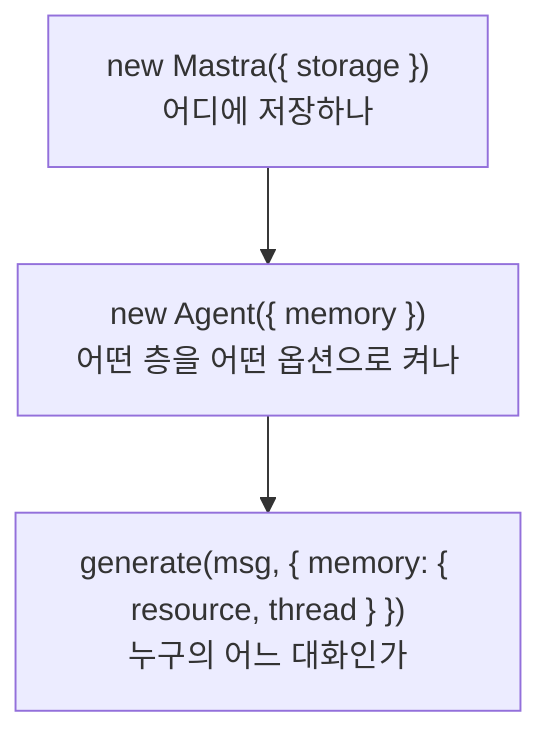

# Memory

진행 계획만 적어 둔 틀이다. 내용은 소제목을 하나씩 볼 때마다 아래에 채운다.

## 1. Overview

원문: https://mastra.ai/docs/memory/overview

| 소제목 | 처리 |
|---|---|
| When to use memory, Quickstart, Message history | 다룸 (1-1) |
| What the model sees | 다룸 (1-2, 개념만) |
| Observational Memory | 건너뜀. 3에서 본다 |
| Memory in multi-agent systems | 건너뜀. Supervisor agents 문서 범위다 |
| Observability | 건너뜀. 10회차 Observe에서 트레이스로 본다 |
| Switch memory per request | 건너뜀. `RequestContext`는 9회차 Server에서 본다 |

### 1-1. storage, Memory, resource와 thread

#### 개념

7회차의 에이전트 루프는 `generate` 호출 하나 안에서만 메시지 목록을 누적하고, 호출이 끝나면 그 목록을 버렸다. Memory는 같은 목록을 storage에 저장해 두었다가 다음 호출 때 다시 꺼내 컨텍스트에 넣는다.

Mastra는 기억을 네 개의 층으로 나눈다. 기본으로 켜지는 것은 message history 하나뿐이다.

| 층 | 저장하는 것 | 기본값 | 다루는 절 |
|---|---|---|---|
| Message history | 최근 N개 메시지 원문 | `lastMessages: 10` | 2 |
| Observational Memory | 오래된 메시지를 압축한 관찰 기록 | 꺼짐 | 3 |
| Working memory | 이름·선호 같은 구조화된 사용자 상태 | `enabled: false` | 4 |
| Semantic recall | 임베딩 유사도로 찾은 과거 메시지 | `false` | 5 |

공식 문서의 옵션 설명에는 기본값이 적혀 있지 않다. 위 값은 `node_modules/@mastra/core/dist/agent-D-8HgWUU.js:16829-16834`의 `memoryDefaultOptions`에서 직접 확인한 것이다.

켜는 데 필요한 것은 세 가지이고, 놓이는 자리가 각각 다르다.



`storage`는 Mastra 인스턴스에 한 번 등록하면 거기 등록된 모든 에이전트가 물려받는다. `Memory`에 `storage`를 직접 주지 않으면 에이전트가 `getMemory()`를 호출할 때 Mastra의 것을 대신 넣어 준다. (`agent-D-8HgWUU.js:33545-33550`) 생성자에 `storage`를 준 경우에만 `hasOwnStorage`가 참이 되어 주입을 건너뛴다. (`:16902-16904`) 양쪽 어디에도 없으면 "Memory requires a storage provider to function" 오류가 난다. (`:16937`)

`Memory`는 에이전트마다 따로 만든다. 같은 DB를 쓰더라도 몇 개를 기억할지는 에이전트 성격에 따라 달라지기 때문이다.

`resource`는 스레드의 소유자이고 `thread`는 대화 하나다. Spring 웹 애플리케이션으로 치면 `resource`가 `userId`, `thread`가 `conversationId`에 해당한다. 스레드의 소유자는 만든 뒤 바꿀 수 없고, 같은 스레드 id를 다른 소유자로 다시 쓰면 조회할 때 오류가 난다. Studio는 두 값을 자동으로 만들어 주고, 스크립트나 서버 코드에서는 직접 넘겨야 한다.

클라이언트는 새 메시지 하나만 보내야 한다. 대화 전체를 다시 보내면 storage에서 읽어 온 것과 겹치고, 클라이언트가 찍은 타임스탬프와 저장된 타임스탬프가 어긋나 순서가 꼬인다.

#### 왜 libSQL인가

공식 문서에 데이터베이스 연동 페이지가 열일곱 개 있고 PostgreSQL, MySQL, MongoDB, Redis, ClickHouse 등이 포함된다. PostgreSQL은 지원되지 않는 것이 아니라 오히려 운영 환경의 권장 선택지다. libSQL 문서 자체가 "libSQL은 로컬 개발에 이상적이다. 트레이스 양이 많은 운영 환경에서는 PostgreSQL이나 composite storage를 통한 ClickHouse를 고려하라"고 적는다. (`integrations-databases-libsql.md:159-161`)

| 항목 | libSQL | PostgreSQL |
|---|---|---|
| 설치 | 필요 없다. 파일 하나가 DB다 | 서버를 띄우고 계정과 DB를 만들어야 한다 |
| 문서의 권장 용도 | 로컬 개발 | 운영 |

어댑터를 바꾸는 일은 `src/mastra/storage.ts` 한 파일에서 끝난다. storage 생성을 별도 파일로 뺀 이유가 이것이다.

다만 어댑터 선택이 완전히 자유롭지는 않다. Working memory를 사용자 단위로 쓰려면 `mastra_resources` 테이블을 지원하는 어댑터라야 하고, 문서는 libSQL, PostgreSQL, OracleDB, Upstash, MongoDB 다섯 개를 명시한다.

#### TypeScript 문법 (Java 대응)

| 표현 | 뜻 | Java 대응 |
|---|---|---|
| `import path from 'node:path'` | Node 내장 모듈을 가져온다. `node:` 접두사가 내장임을 밝힌다 | `java.nio.file.Path` |
| `process.env.X` | 환경 변수를 읽는다 | `System.getenv("X")` |
| `a ?? b` | `a`가 `null`이거나 `undefined`일 때만 `b`를 쓴다 | `Objects.requireNonNullElse(a, b)` |
| `a \|\| b` | `a`가 거짓값이면 `b`를 쓴다. 빈 문자열도 거짓값이다 | 대응하는 연산자가 없다 |
| `{ url }` | `{ url: url }`의 축약이다 | 없다 |
| `{ [KEY]: value }` | 상수의 값을 키로 쓴다 | `Map.of(KEY, value)` |

`storage.ts`는 7행에서 `??`를 쓰고 11행에서 `||`를 쓴다. 일부러 다르다. `.env`에 `DATABASE_URL=`처럼 값을 비워 두면 그 값은 `null`이 아니라 빈 문자열이 된다. 11행에 `??`를 쓰면 빈 문자열이 그대로 통과해 접속 주소가 비어 버린다.

`LibSQLStore`의 `id`는 선택이 아니라 필수다. 타입 선언에 물음표가 없다. (`node_modules/@mastra/libsql/dist/storage/index.d.ts:50`)

#### 실습 결과

`resource`를 `user-1`로 고정하고 `thread`를 `todo-1`과 `todo-2`로 나눠 세 번 호출했다.

| 호출 | 대화 | 보낸 말 | 받은 답 |
|---|---|---|---|
| 1 | `todo-1` | 이름을 말하며 할 일을 추가해 달라고 했다 | 이름을 부르며 추가했다고 답했다 |
| 2 | `todo-1` | 이름을 물었다 | "홍길동님입니다!" |
| 3 | `todo-2` | 같은 질문을 했다 | 이름을 모른다고 답했다 |

`resource`가 같아도 `thread`가 다르면 기억이 넘어가지 않는다.

**도구 호출은 메시지 개수를 늘리지 않는다.** 첫 턴은 도구를 한 번 불렀는데도 메시지가 두 개만 저장됐다. 사용자 메시지 하나와 assistant 메시지 하나다. 그 assistant 메시지 안에 part가 세 개 있고, 도구 호출과 그 결과가 `tool-invocation` part 하나에 `state: 'result'`로 합쳐져 있다. 나머지는 `step-start`와 최종 텍스트다.

저장되는 메시지의 `role`은 `user`, `assistant`, `system`, `signal` 네 가지뿐이고 `tool`이 없다. (`node_modules/@mastra/core/dist/agent/message-list/state/types.d.ts:11`) `role: 'tool'`과 `type: 'tool-call'`은 구버전 타입에만 남아 있다. (`types.d.ts:88-99`)

그래서 `lastMessages`는 메시지를 세지 part를 세지 않는다. 도구를 몇 번 부르든 한 턴은 메시지 두 개다. 다만 컨텍스트 토큰은 part 수만큼 늘어나므로, 도구 결과가 큰 에이전트라면 `lastMessages`를 줄여도 토큰이 줄지 않을 수 있다. 토큰 기준으로 자르는 장치는 6에서 본다.

**대화는 남고 할 일은 사라졌다.** 세 번째 턴에서 할 일 목록을 물었더니 빈 배열이 돌아왔다. 첫 턴에서 id 1로 저장에 성공했는데도 그랬다. 두 호출이 서로 다른 프로세스였고, `src/mastra/todo`의 할 일 배열은 프로세스 메모리에 있어서 함께 사라졌기 때문이다. Memory가 저장하는 것은 대화이지 도메인 데이터가 아니라는 말이 이 한 장면에 그대로 나왔다. 할 일 자체의 저장은 9회차 Storage에서 다룬다.

그 밖에 확인한 것은 세 가지다.

- DB 파일은 프로젝트 루트에 `mastra.db`로 생겼다. 다만 스크립트를 루트에서 돌린 결과이고, `mastra dev`가 같은 파일을 여는지는 Studio를 띄워 확인해야 한다.
- 스레드 제목은 두 개 모두 비어 있다. `generateTitle` 기본값이 거짓이기 때문이고, 2-1에서 켠다.

실습이 끝난 뒤 `lastMessages`는 기본값 10으로 되돌렸다.

#### clap-agent

- storage는 PostgreSQL이다. `src/mastra/index.ts:52`에서 `PostgresStoreVNext`를 만들고, 풀 크기 같은 조립은 `src/mastra/storage.ts:11-22`로 뺐다. 이 저장소가 `storage.ts`를 나눈 것과 같은 구조다.
- 풀 상한에 근거가 붙어 있다. 주 풀 10과 observability 풀 5를 합쳐 태스크당 15로 잡았고, 개발 RDS의 최대 접속 수 79를 실측해 맞춘 값이라고 주석에 적혀 있다. 기본값을 그대로 두면 배포 중에 구 태스크와 신 태스크가 겹쳐 한도를 넘을 수 있기 때문이다.
- `Memory`는 에이전트마다 따로 만든다. `agents/clap-agent.ts:110-112`는 `lastMessages: 20`을 직접 적고, `agents/policy-agent.ts:48-50`은 상수 `POLICY_HISTORY_LAST_MESSAGES`를 쓴다. (`agents/constants.ts:16`) 테스트가 값을 고정해야 해서 상수로 뺐다.
- `resource`를 클라이언트가 정하지 못하게 막는다. 인증 프로바이더가 `mapUserToResourceId`로 `clap-user-{id}`를 만들어 요청 본문의 값보다 우선시킨다. (`auth/clap-session-auth.ts:74-79`) 다른 사용자의 메모리에 접근하지 못하게 하는 장치다.
- `thread` id에 규약이 있다. 리뷰 대화는 `{리뷰그룹id}_{UUID}` 형식이고 정규식으로 검증한다. (`server/review/review-thread-id.ts:2-3`) 접두사를 조회 필터로 쓰기 위해서다.
- 기억이 없는 편이 맞는 에이전트도 있다. 실험용 변형에는 `memory`가 없다. 평가 항목은 서로 독립이라 기억이 있으면 안 되고, Studio 실험에서는 `threadId`가 예약 키라 Memory가 있으면 항상 실패하기 때문이다. (`agents/clap-eval-agent.ts:8-10`)

이 저장소에서는 `resource`를 스크립트에 직접 적었다. 운영에서는 그러면 안 된다. 클라이언트가 `resource`를 보내게 두면 다른 사람의 대화를 그대로 읽을 수 있다. Mastra 자체는 접근 제어를 해 주지 않는다.

#### 헷갈렸던 지점

- 왜 libSQL을 쓰나, PostgreSQL은 지원하지 않나 → 지원한다. 운영에는 PostgreSQL이 권장이고, libSQL은 서버 없이 파일 하나로 끝나 실습에 맞아서 골랐다.

### 1-2. 모델이 보는 컨텍스트

#### 개념

메모리는 별도 통로로 모델에게 전달되지 않는다. 결국 모델에게 보내는 메시지 목록 안으로 들어간다. 층마다 들어가는 자리가 다르고, 그 차이가 나머지 페이지를 읽는 기준이 된다.

```
[ system 메시지 ]
  1. instructions (에이전트 정의)
  2. 호출할 때 넘긴 system 메시지
  3. Working memory (템플릿과 현재 값)
  4. Semantic recall 중 '다른 스레드'에서 찾은 것
  5. Observational Memory (관찰·반추 기록)

[ 대화 메시지 ]
  6. Message history 최근 N개
     Semantic recall 중 '같은 스레드'에서 찾은 것
     → 둘은 타임스탬프 순으로 섞인다
  7. 호출 옵션 context 배열
  8. 새 사용자 메시지 (항상 맨 마지막)
```

이 순서는 Overview 페이지의 "What the model sees" 그림이 말하는 것이다.

세 가지가 중요하다.

- `lastMessages`가 자르는 것은 6번뿐이다. Working memory와 Observational Memory는 system 자리에 있어서 개수 제한과 무관하게 항상 들어간다.
- Semantic recall은 찾은 위치에 따라 자리가 갈린다.
- `context` 옵션은 저장되지 않는다. 호출 시각이 찍히므로 기록과 recall보다 뒤, 새 메시지보다 앞에 놓인다.

대화 메시지는 타임스탬프로 정렬하고 메시지 id로 중복을 제거한다. 그래서 recall이 끌어온 오래된 메시지가 최근 기록보다 앞에 놓인다. 클라이언트가 대화 전체를 다시 보내면 안 되는 이유가 여기 있다. 중복 제거는 id 기준인데 클라이언트가 새로 만든 메시지는 id가 달라 걸러지지 않는다.

Observational Memory를 켜면 6번의 성격이 바뀐다. 이미 관찰된 메시지는 대화에서 빠지고 5번의 system 메시지로 대체되며, 아직 관찰되지 않은 최근 메시지만 대화에 남는다. 기억을 늘리면서 컨텍스트는 줄이는 구조이고, 문서가 이 층을 권장으로 표시한 이유다.

실제 요청에 무엇이 들어갔는지는 트레이스의 LLM 호출 span에서 본다. 10회차에서 다룬다.

#### context 옵션

호출할 때만 붙이는 임시 대화 메시지 배열이다. 타입은 `ModelMessage[]`이고 `role`과 `content`를 가진 메시지 객체를 넣는다. (`node_modules/@mastra/core/dist/agent/agent.types.d.ts:477`)

```ts
await agent.generate('이 주문 환불해 줘', {
  context: [{ role: 'system', content: '현재 사용자 등급: VIP, 잔여 환불 한도: 2회' }],
});
```

프롬프트에 문자열로 붙이는 것과 세 가지가 다르다.

| | `context` | `instructions`에 붙이기 | 사용자 메시지에 붙이기 |
|---|---|---|---|
| 놓이는 자리 | 대화 메시지, 기록 뒤 새 메시지 앞 | system, 맨 앞 | 사용자 메시지 안 |
| 저장 | 안 된다 | 안 된다 | 된다 |
| 사용자에게 보이나 | 안 보인다 | 안 보인다 | 보인다 |

저장되지 않는 것이 핵심이다. 사용자 메시지에 배경 정보를 끼워 넣으면 그것이 대화 기록에 남아 다음 호출에도 계속 딸려 온다. 그때는 이미 낡은 값인데도 그렇다. Spring으로 치면 요청 스코프 빈에 가깝다. 요청이 끝나면 사라지고 다음 요청은 새 값을 받는다.

문서가 드는 예는 앱 상태와 직접 만든 RAG 결과 두 가지다. 앱 상태는 지금 보고 있는 화면이나 사용자 등급처럼 요청마다 바뀌는 값이고, RAG 결과는 사내 문서 같은 외부 지식을 직접 찾아 넣는 경우다.

#### semantic recall을 나눠 넣는 이유

다른 대화에서 찾은 것은 통째로 감싼 system 메시지 하나가 된다. (`agent-D-8HgWUU.js:18243-18266`)

```
The following messages were remembered from a different conversation:
<remembered_from_other_conversation>

the following messages are from 2026, Sep, 12
Message from previous conversation at 3:04 PM: User: 나는 매운 걸 못 먹어
Message from previous conversation at 3:04 PM: Assistant: 기억해 두겠습니다

<end_remembered_from_other_conversation>
```

섞으면 지금 대화가 아닌 것이 지금 대화인 척하게 되기 때문이다. 대화 메시지는 타임스탬프 순으로 정렬되므로, 다른 대화의 사용자 발화를 그대로 끼워 넣으면 모델이 보기에 이 대화에서 방금 한 말과 구분되지 않는다. 어제 다른 대화에서 한 말을 지금 요청으로 착각하고 그에 답할 수 있다.

같은 대화에서 찾은 것은 그 문제가 없다. 원래 이 대화에서 오갔던 말이고 `lastMessages` 창 밖으로 밀려났을 뿐이라, 제자리인 시간순에 도로 끼워 넣는 편이 맥락을 복원한다.

정렬 코드에 재현성 장치가 붙어 있다. (`:18215-18222`) 벡터 검색 결과는 유사도 점수에 따라 같은 질의라도 순서가 흔들릴 수 있어서, 시각과 스레드 id, 역할, 메시지 id 순으로 다시 정렬한 뒤 문자열을 만든다. 순서가 흔들리면 프롬프트 문자열이 달라져 캐시가 매번 어긋나고 평가 결과도 호출마다 달라지기 때문이다. 라벨 형식은 longmemeval 벤치마크로 검증한 것이라 고정해 두었다는 주석도 있다. (`:18242`)

#### clap-agent

- `context` 옵션은 저장소 전체에서 한 번도 쓰지 않는다. 요청마다 달라지는 맥락, 즉 어느 상위리뷰에 관한 대화인지는 `instructions`를 함수로 두어 system 자리에 넣는다. (`agents/clap-agent.ts:73-78`)
- 이유는 프롬프트 캐싱이다. Anthropic 캐시는 프리픽스가 글자 단위로 같아야 맞으므로 system 메시지를 두 덩어리로 나눴다. 앞 덩어리(지침, 도메인 지식, 코드 모드 선언)에 캐시 마커를 붙이고, 뒤 덩어리에 요청별 값을 둔다. 요청별 값을 앞에 두면 상위리뷰가 바뀔 때마다 모든 사용자가 공유하던 프리픽스가 통째로 무효가 된다. (`clap-agent.ts:71-72`)
- 앞 덩어리는 한 번 만들어 변수에 담아 두고 계속 돌려쓴다. (`clap-agent.ts:53-63`) 매번 새로 문자열을 만들면 내용이 같아도 캐시 프리픽스가 어긋날 수 있기 때문이다.
- working memory는 일부러 끈다. 켜면 Mastra가 갱신 도구 호출을 강제해 루프가 끝나지 않고 같은 말풍선에 답이 두 번 찍혔으며, 담기던 정보도 대화 단위라 `lastMessages`로 이미 들어오는 내용과 겹쳤다. (`clap-agent.ts:108-109`)

`context`와 함수형 `instructions`의 차이는 자리다. 저장되지 않는다는 점은 같다. 캐싱을 쓰는 Anthropic 모델이라면 system 자리가 유리하고, 이번 요청에만 쓸 검색 결과처럼 양이 크고 매번 다른 것이라면 `context`가 자연스럽다.

#### 헷갈렸던 지점

- `context` 옵션이 뭔가 → 호출할 때만 붙이는 임시 대화 메시지 배열이고, 그 요청에서만 쓰이며 저장되지 않는다.
- semantic recall은 왜 나눠서 넣나 → 다른 대화의 메시지를 시간순에 섞으면 지금 대화의 발화와 구분되지 않아서, 태그로 감싼 system 메시지 하나로 따로 넣는다.

## 2. Message History

원문: https://mastra.ai/docs/memory/message-history

| 소제목 | 처리 |
|---|---|
| Threads and resources, Getting started | 건너뜀. 1-1과 겹친다 |
| Thread title generation | 다룸 (2-1) |
| Accessing memory, Querying (Threads, Messages) | 다룸 (2-2) |
| UI format | 건너뜀. 프론트엔드 변환 함수라 레퍼런스로 충분하다 |
| Thread cloning, Deleting messages | 건너뜀. 필요할 때 레퍼런스로 찾는다 |

### 2-1. 스레드 제목 생성

#### 개념

채팅 UI 왼쪽에 대화 목록을 보여 주려면 대화마다 이름이 필요하다. `generateTitle`을 켜면 Mastra가 대화 내용을 보고 제목을 지어 저장한다.

응답이 나간 뒤 별도 LLM 호출이 한 번 더 돈다. 문서는 비동기로 돌아 응답 시간에 영향이 없다고 적는다. 소스를 보면 제목 생성 Promise를 만들어 두고 응답 흐름을 막지 않으며, 서버리스 환경에서는 `waitUntil`에 넘겨 프로세스가 먼저 종료되지 않게 한다.

스레드마다 한 번만 돈다. 조건이 `shouldGenerate && !thread.title`이라 제목이 이미 있으면 건너뛴다. (`agent-D-8HgWUU.js:37006`) 대화가 길어져도 제목은 처음 것으로 남는다. 빈 문자열은 없는 것으로 취급되므로 제목이 비어 있던 스레드는 다음 호출에서 채워진다.

| 형태 | 모델 | 지침 |
|---|---|---|
| `generateTitle: true` | 에이전트 본체 모델 | Mastra 기본 지침 |
| `generateTitle: { model, instructions }` | 지정한 모델 | 지정한 지침 |

문서가 권하는 것은 두 번째다. 제목은 짧은 문장 하나라 본체 모델을 쓸 이유가 없다.

#### 모델에게 무엇이 가나

사용자 첫 메시지만 가는 것이 아니다. 대화 전체를 평문으로 눌러 담아 보낸다. 각 줄에 `User:`, `Assistant:` 접두사가 붙고 도구 호출과 도구 결과, 추론 내용, 첨부 파일 URL까지 줄로 들어간다. 도구 관련 줄은 200자에서 잘린다. (`agent-D-8HgWUU.js:34491-34521`)

```
User: 내 이름은 홍길동이야. 내일 오전 회의 준비를 할 일에 추가해 줘
Tool Result addTodoTool: {"id":1,"title":"내일 오전 회의 준비","done":false}
Assistant: 홍길동님, '내일 오전 회의 준비'를 할 일 목록에 추가했습니다!
```

제목 호출에는 에이전트의 `instructions`가 실리지 않는다. 별도 LLM 호출이고 system 자리에는 제목용 지침만 들어간다. 본체 프롬프트에 "항상 한국어로 답해"라고 적어 두어도 제목은 그 규칙을 모른다.

기본 지침은 여덟 줄이고 80자 이내, 따옴표와 콜론 금지, 사용자 메시지 요약, 그리고 "대화록에 답하거나 이어 쓰지 말 것"을 담는다. (`agent-D-8HgWUU.js:38231-38238`) 마지막 줄이 있는 이유는 대화록을 통째로 받은 모델이 제목 대신 답변을 내놓는 일이 실제로 있기 때문이다.

문서에 없는 옵션도 하나 있다. `minMessages`로 메시지가 몇 개 쌓인 뒤에 제목을 만들지 정할 수 있고 기본값은 1이다.

#### 실습 결과

제목용 모델은 `gemini-3.5-flash-lite`로 골라 `models.ts`에 상수를 추가했다. 본체보다 작고 싼 모델이면 충분한 자리다.

지침은 여섯 줄로 직접 썼다. 기본 지침을 통째로 대체하기 때문에 기본이 이미 하던 방어까지 다시 적어야 했다.

| 줄 | 왜 넣었나 |
|---|---|
| 첫 번째 User 줄만 보고 짓는다 | 대화 전체가 넘어가므로 어시스턴트 응답과 도구 결과가 제목에 섞일 수 있다 |
| 한국어 한 줄, 20자 이내 | 본체 프롬프트의 한국어 규칙이 여기 실리지 않는다. 기본 지침의 80자는 사이드바에 길다 |
| 마크다운·따옴표·콜론·마침표·줄바꿈 금지 | 돌려준 글자가 그대로 제목이 되므로 서식이 그대로 노출된다 |
| 라벨 금지 | 작은 모델이 "제목: 회의 준비"처럼 답하는 일이 흔하다 |
| 대화록에 답하지 말 것 | 기본 지침이 가지고 있던 방어다. 대체하면서 잃어버리면 제목 대신 답변이 나온다 |

지침을 한국어로 쓴 것은 이 에이전트가 한국어 전용이기 때문이다. 지침 언어가 출력 언어를 끌어당기는데, 여기서는 항상 한국어가 정답이라 그 끌어당김이 도움이 된다. 다국어를 받아야 하는 순간 이 선택은 뒤집힌다.

제목이 실제로 어떤 문장으로 나오는지는 다음 실습에서 확인한다.

#### clap-agent

도입 커밋(#281) 이후 네 번 고쳤다.

| PR | 증상 | 고친 방법 |
|---|---|---|
| #340 | 방 제목에 어시스턴트 답변과 마크다운이 섞였다 | 지침에 기준 메시지와 서식 금지를 명시 |
| #355 | 제목 앞에 "제목:" 라벨이 붙었다 | 지침에 라벨 금지를 추가 |
| #361 | 여전히 AI 답변이 제목으로 샜다 | 제목 생성 모델을 Sonnet으로 올림 |
| #380 | 영어로 물어도 제목이 한국어로 나왔다 | 지침을 영어로 바꿔 언어 바이어스를 끊음 |

네 번 중 세 번이 지침 문장 수정이고 한 번이 모델 상향이다. 제목 한 줄을 만드는 자리인데도 프롬프트만으로 되지 않아 더 비싼 모델로 올려야 했다.

테스트가 지침 문자열을 통째로 리터럴로 고정한다. (`agents/clap-agent.test.ts:238-247`) 네 번 회귀한 자리라 문장이 실수로 바뀌는 것을 막으려는 장치다.

지침 자체는 영어로 쓰고 "제목 언어는 사용자 첫 메시지의 언어와 정확히 일치시켜라"를 명시했다. (`agents/clap-agent.ts:119`) 다국어 서비스라 지침 언어가 출력 언어를 끌어당기면 안 되기 때문이다.

우리 지침과 겹치는 항목이 많다. 기준 메시지 한정, 라벨 금지, 서식 금지, 줄바꿈 금지가 그렇다. 같은 문제에 같은 방어가 필요했다는 뜻이고, 제목 생성을 켤 때 `generateTitle: true`로 두지 말고 처음부터 지침을 직접 쓰는 편이 낫다는 근거이기도 하다.

#### 헷갈렸던 지점

- 제목 호출에 에이전트 프롬프트가 실리나 → 실리지 않는다. 언어와 형식 규칙을 제목 지침에 다시 적어야 한다.

### 2-2. 스레드와 메시지 조회

#### 개념

에이전트를 부르지 않고 저장된 것만 읽는 경우다. 채팅 UI의 대화 목록 화면, 지난 대화를 열었을 때 메시지를 불러오는 화면이 여기 해당한다. `agent.getMemory()`로 `Memory` 인스턴스를 얻어 직접 조회한다.

| 메서드 | 대상 | 돌려주는 값 |
|---|---|---|
| `listThreads` | 대화방 목록 | 스레드 배열과 `total`, `page`, `perPage`, `hasMore` |
| `getThreadById` | 대화방 하나 | 스레드 객체 또는 `null` |
| `recall` | 그 방 안의 메시지 | 메시지 배열과 페이징 정보 |

`getThreadById`와 `recall`은 겹치지 않는다. 스레드 객체에는 id, 제목, 소유자, 생성·수정 시각, metadata만 들어 있고 메시지는 없다. (`node_modules/@mastra/core/dist/memory/types.d.ts:34-41`) 화면으로 보면 왼쪽 대화 목록이 `listThreads`, 오른쪽 대화 내용이 `recall`이고, `getThreadById`는 목록에서 하나를 클릭했을 때 그 방이 실재하는지와 내 것이 맞는지 확인하는 자리다.

`recall`은 단순 조회만 하지 않는다. `vectorSearchString`을 넘기면 semantic recall이 함께 돌아 의미가 비슷한 과거 메시지를 찾아 섞어 준다. 이름이 `listMessages`가 아닌 이유다.

#### 접근 제어는 앱 몫이다

`listThreads`의 `filter`도 `filter.resourceId`도 타입상 선택이다. (`node_modules/@mastra/core/dist/storage/types.d.ts:167-177`) 빠뜨리면 오류가 나는 것이 아니라 모든 사용자의 스레드가 그대로 나온다. 경고도 없다.

`recall`에 `resourceId`를 함께 넘기는 것은 방어 장치다. 넘기면 스레드 소유자와 다를 때 걸러 주고, 넘기지 않으면 스레드 id만 맞으면 남의 메시지도 나온다.

Spring으로 치면 `@PreAuthorize`에 해당하는 장치가 라이브러리에 없다는 뜻이다. "지금 로그인한 사용자가 이 `resourceId`의 주인인가"는 앱 코드가 검사해야 한다.

#### 프런트엔드는 어떻게 부르나

이 메서드들은 서버에서 돈다. DB 접속 정보를 들고 있으므로 브라우저에서 직접 부를 수 없다. 프런트엔드는 HTTP로 서버를 부르고, 서버가 이 메서드를 호출한다.

`@mastra/server`가 메모리 조회 경로를 기본으로 열어 둔다. (`node_modules/@mastra/server/dist/memory-CBLqn9xl.js:169-229`)

| 메서드와 경로 | 하는 일 |
|---|---|
| `GET /memory/threads` | 스레드 목록 |
| `GET /memory/threads/:threadId` | 스레드 하나 |
| `GET /memory/threads/:threadId/messages` | 그 스레드의 메시지 |
| `GET /memory/threads/:threadId/working-memory` | working memory 값 |
| `DELETE /memory/threads/:threadId` | 스레드 삭제 |

`npm run dev`로 서버를 띄우고 `http://localhost:4111/swagger-ui`를 열면 전체 목록을 보고 바로 호출해 볼 수 있다.

기본 경로를 그대로 쓰면 문제가 하나 있다. `resourceId`를 쿼리 파라미터로 받으므로 브라우저가 그 값을 정한다. 남의 `resourceId`를 넣으면 남의 대화 목록이 나온다. 인증을 어디서 거는지가 핵심이고, 9회차 Server 절에서 미들웨어와 커스텀 라우트로 다룬다.

#### 페이징 방식

오프셋 방식이다. 커서 방식이 아니다. libSQL 구현이 `LIMIT ? OFFSET ?`로 끝난다. (`node_modules/@mastra/libsql/dist/index.js:8533`)

| 인자 | 뜻 | 기본값 |
|---|---|---|
| `page` | 몇 번째 쪽인가. 0부터 센다 | 0 |
| `perPage` | 한 쪽에 몇 개인가 | 100 |
| `perPage: false` | 페이징 없이 전부 가져온다 | |

`hasMore`가 참인 동안 `page`를 올려 가며 이어 붙이면 무한 스크롤이 된다. 다만 오프셋 방식의 약점을 그대로 받는다. 목록을 보는 중에 옛 대화에 메시지가 하나 들어오면 그 스레드가 맨 위로 올라오고, 그 상태에서 다음 쪽을 부르면 이미 본 항목이 다시 나오거나 못 본 항목이 건너뛰어진다. 뒤쪽 쪽으로 갈수록 느려지는 것도 같은 이유다.

구현이 쪽마다 `COUNT(*)`를 한 번 더 돌린다는 점도 알아 둘 만하다. (`:8518`) `total`을 채우기 위해서인데, 무한 스크롤이라면 총 개수가 화면에 필요 없는 경우가 많다.

#### 실습 결과

`resourceId`를 `user-1`로 넣고 `npm run threads`를 돌렸다.

```
[스레드] 2개

- id=todo-1 title=(없음)
    user: 내 이름은 홍길동이야. 내일 오전 회의 준비를 할 일에 추가해 줘
    assistant: 홍길동님, '내일 오전 회의 준비'를 할 일 목록에 추가했습니다!
    user: 내 이름이 뭐야?
    assistant: 홍길동님입니다!
    user: 할 일 목록 보여 줘
    assistant: 현재 저장된 할 일이 없습니다. 새로운 할 일을 추가하고 싶으시다면 언제든 말씀해 주세요!

- id=todo-2 title=(없음)
    user: 내 이름이 뭐야?
    assistant: 죄송하지만, 아직 이름이 무엇인지 알려주시지 않아서 알지 못합니다. 이름을 알려주시면 기억해 둘게요!
```

스크립트에서 `parts` 중 텍스트만 골라 내므로 도구 호출 part는 출력에서 빠진다. 1-1에서 확인한 저장 구조 때문이고, 그대로 찍으면 JSON 덩어리가 나온다.

#### clap-agent

기본 REST 경로를 쓰지 않고 커스텀 라우트를 목록·단건·메시지·삭제로 나눠 만들었다.

- metadata로 DB 필터를 건다. 리뷰 그룹별로 대화방을 나눠 보여 주려고 `listThreads`의 `filter.metadata`에 리뷰 그룹 번호를 넘긴다. (`server/review/review-thread-list.ts:35-47`) 가져온 뒤 코드로 거르지 않는 이유는 `total`과 `hasMore`가 필터 기준으로 정확해야 하기 때문이다. 나중에 걸러 내면 총 개수가 부풀어 다음 쪽이 있다고 잘못 말한다.
- 필터를 붙일지 판단할 때 참·거짓이 아니라 `undefined`인지를 본다. 빈 문자열을 거짓으로 처리하면 필터가 통째로 빠져 모든 방이 나가기 때문이다. (`review-thread-list.ts:41`)
- 같은 조건을 두 번 검사한다. DB 필터로 한 번 거르고, 가져온 스레드의 id 접두사로 다시 거른다. metadata가 오염돼도 id 접두사가 정본이라는 판단이다. (`review-thread-list.ts:57-59`)
- 메시지는 `user`와 `assistant`만 내보낸다. working memory 알림 같은 `system`, `signal` 턴은 사용자에게 보여 줄 것이 아니다. (`review-thread-messages.ts:62-65`)
- 객체를 통째로 펼치지 않고 필요한 필드만 골라 담는다. 그대로 펼치면 `content.metadata`, `toolInvocations`, `resourceId` 같은 것이 응답으로 새어 나간다. `content`와 `parts`는 선택적으로 읽어 깨진 행 하나로 방 전체가 500이 되지 않게 막는다. (`review-thread-messages.ts:66-70`)
- 정렬을 명시한다. 적지 않고 암묵적인 내림차순에 기대면 "0쪽이 최신"이라는 계약이 구현에 매달리고, 라이브러리가 바뀌면 조용히 뒤집힌다. (`review-thread-messages.ts:51-60`)
- `@mastra/pg` 1.17.0에서 직접 재 보고 쓴 주석이 있다. 어댑터가 metadata 필터를 무시하면 노출은 막히지만 총 개수가 어긋나고, 그것은 목 객체로 잡히지 않으니 버전을 올릴 때 실제 DB로 다시 확인하라고 적어 두었다.

실습 스크립트는 `message.content.parts`를 그냥 읽는다. 행이 하나라도 예상과 다르면 그 자리에서 터진다. 실습에서는 괜찮지만 운영에서는 위 방어가 필요하다.

#### 헷갈렸던 지점

- `getThreadById`와 `recall`의 차이 → 앞은 대화방 객체 하나, 뒤는 그 방 안의 메시지 배열이다. 스레드 객체에 메시지는 들어 있지 않다.
- `perPage`는 어떻게 페이징되나, 무한 스크롤인가 → `LIMIT`과 `OFFSET`을 쓰는 오프셋 방식이다. `hasMore`를 보고 `page`를 올려 가며 무한 스크롤로 쓸 수는 있지만 목록이 바뀌면 항목이 밀린다.
- 이걸 프런트엔드에서 직접 부르나 → 아니다. 서버에서 돈다. 프런트엔드는 서버가 열어 둔 HTTP 경로를 부른다.

## 3. Observational Memory

원문: https://mastra.ai/docs/memory/observational-memory

문서가 Recommended로 표시한 층이다. 소제목이 스물몇 개라 실무에서 먼저 정해야 하는 것만 고른다.

| 소제목 | 처리 |
|---|---|
| Quickstart, How it works (Observations, Reflections) | 다룸 (3-1) |
| How context changes over time, Benefits | 다룸 (3-1) |
| Models, Token-tiered model selection | 다룸 (3-2). 비용과 직결된다 |
| Scopes (thread, resource) | 다룸 (3-2) |
| Token budgets | 다룸 (3-2, 개념만) |
| Comparing OM with other memory features | 다룸 (3-3, 개념만) |
| Studio | 실습에서 확인한다 |
| Extractors, Working memory updates, Retrieval mode | 건너뜀. 기본 동작을 먼저 본다 |
| Early activation, Temporal gap markers, Async buffering | 건너뜀. 튜닝 옵션이다 |
| Observer Context Optimization, Token counting cache | 건너뜀. 튜닝 옵션이다 |
| Caller-supplied token estimates, Migrating existing threads | 건너뜀. 운영 이관용이다 |

## 4. Working Memory

원문: https://mastra.ai/docs/memory/working-memory

| 소제목 | 처리 |
|---|---|
| Quickstart, How it works | 다룸 (4-1) |
| Memory persistence scopes (resource, thread) | 다룸 (4-1) |
| Custom templates, Designing effective templates | 다룸 (4-1) |
| Structured working memory, Choosing between template and schema | 다룸 (4-2) |
| Storage adapter support | 다룸 (4-2, 한 줄) |
| Setting initial working memory, Updating programmatically | 다룸 (4-3, 개념만) |
| Personal info, Preferences, Session state, Multi-step retention | 건너뜀. 템플릿 예시 나열이다 |
| Read-only working memory, Opt in to state signals | 건너뜀. 실험 기능이다 |
| Examples | 건너뜀 |

## 5. Semantic Recall

원문: https://mastra.ai/docs/memory/semantic-recall

| 소제목 | 처리 |
|---|---|
| How semantic recall works, Quickstart | 다룸 (5-1) |
| Storage configuration, Embedder configuration (Model Router) | 다룸 (5-1) |
| Recall configuration (topK, messageRange, scope) | 다룸 (5-2) |
| Metadata filtering | 다룸 (5-2, 개념만) |
| Viewing recalled messages, Disable semantic recall | 실습에서 확인한다 |
| Using the `recall()` method | 건너뜀. 2-2와 겹친다 |
| Using AI SDK Packages, Using FastEmbed (local) | 건너뜀. Model Router만 쓴다 |
| PostgreSQL index optimization | 건너뜀. 운영 튜닝이다 |

## 6. Memory Processors

원문: https://mastra.ai/docs/memory/memory-processors

7회차 Processors 절에서 미뤄 둔 `TokenLimiter`와 `ToolCallFilter`가 여기서 의미를 가진다.

| 소제목 | 처리 |
|---|---|
| Built-in memory processors (MessageHistory, SemanticRecall, WorkingMemory) | 다룸 (6-1) |
| Processor execution order (Input, Output) | 다룸 (6-1) |
| Guardrails and memory | 다룸 (6-2). 7회차 Guardrails와 이어진다 |
| Manual control and deduplication | 건너뜀. 필요할 때 레퍼런스로 찾는다 |
| Handling large attachments | 건너뜀. 첨부 파일을 쓰지 않는다 |

## 7. Multi-user Threads

원문: https://mastra.ai/docs/memory/multi-user-threads

한 스레드를 여러 사용자가 공유하는 경우를 다룬다. 분량을 보고 개념만 볼지 통째로 건너뛸지 6까지 끝낸 뒤 정한다.
