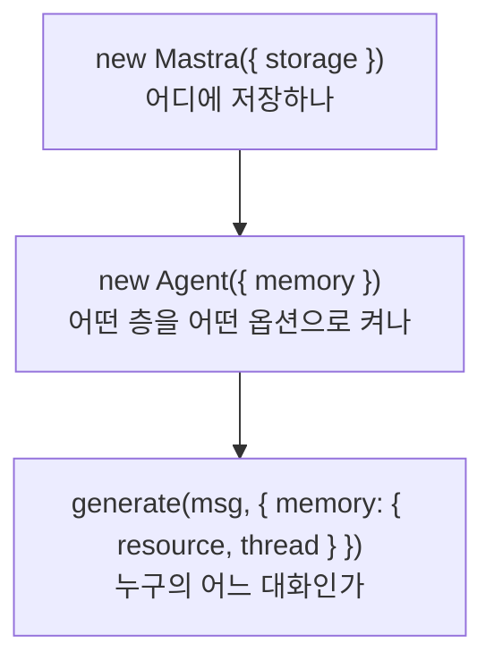

# Memory

진행 계획만 적어 둔 틀이다. 내용은 소제목을 하나씩 볼 때마다 아래에 채운다.

## 1. Overview

원문: https://mastra.ai/docs/memory/overview

| 소제목 | 처리 |
|---|---|
| When to use memory, Quickstart, Message history | 다룸 (1-1) |
| What the model sees | 다룸 (1-2, 개념만) |
| Observational Memory | 건너뜀. 3에서 본다 |
| Memory in multi-agent systems | 건너뜀. Supervisor agents 문서 범위다 |
| Observability | 건너뜀. 10회차 Observe에서 트레이스로 본다 |
| Switch memory per request | 건너뜀. `RequestContext`는 9회차 Server에서 본다 |

### 1-1. storage, Memory, resource와 thread

#### 개념

7회차의 에이전트 루프는 `generate` 호출 하나 안에서만 메시지 목록을 누적하고, 호출이 끝나면 그 목록을 버렸다. Memory는 같은 목록을 storage에 저장해 두었다가 다음 호출 때 다시 꺼내 컨텍스트에 넣는다.

Mastra는 기억을 네 개의 층으로 나눈다. 기본으로 켜지는 것은 message history 하나뿐이다.

| 층 | 저장하는 것 | 기본값 | 다루는 절 |
|---|---|---|---|
| Message history | 최근 N개 메시지 원문 | `lastMessages: 10` | 2 |
| Observational Memory | 오래된 메시지를 압축한 관찰 기록 | 꺼짐 | 3 |
| Working memory | 이름·선호 같은 구조화된 사용자 상태 | `enabled: false` | 4 |
| Semantic recall | 임베딩 유사도로 찾은 과거 메시지 | `false` | 5 |

공식 문서의 옵션 설명에는 기본값이 적혀 있지 않다. 위 값은 `node_modules/@mastra/core/dist/agent-D-8HgWUU.js:16829-16834`의 `memoryDefaultOptions`에서 직접 확인한 것이다.

켜는 데 필요한 것은 세 가지이고, 놓이는 자리가 각각 다르다.

`storage`는 Mastra 인스턴스에 한 번 등록하면 거기 등록된 모든 에이전트가 물려받는다. `Memory`에 `storage`를 직접 주지 않으면 에이전트가 `getMemory()`를 호출할 때 Mastra의 것을 대신 넣어 준다. (`agent-D-8HgWUU.js:33545-33550`) 생성자에 `storage`를 준 경우에만 `hasOwnStorage`가 참이 되어 주입을 건너뛴다. (`:16902-16904`) 양쪽 어디에도 없으면 "Memory requires a storage provider to function" 오류가 난다. (`:16937`)

`Memory`는 에이전트마다 따로 만든다. 같은 DB를 쓰더라도 몇 개를 기억할지는 에이전트 성격에 따라 달라지기 때문이다.

`resource`는 스레드의 소유자이고 `thread`는 대화 하나다. Spring 웹 애플리케이션으로 치면 `resource`가 `userId`, `thread`가 `conversationId`에 해당한다. 스레드의 소유자는 만든 뒤 바꿀 수 없고, 같은 스레드 id를 다른 소유자로 다시 쓰면 조회할 때 오류가 난다. Studio는 두 값을 자동으로 만들어 주고, 스크립트나 서버 코드에서는 직접 넘겨야 한다.

클라이언트는 새 메시지 하나만 보내야 한다. 대화 전체를 다시 보내면 storage에서 읽어 온 것과 겹치고, 클라이언트가 찍은 타임스탬프와 저장된 타임스탬프가 어긋나 순서가 꼬인다.

#### 왜 libSQL인가

공식 문서에 데이터베이스 연동 페이지가 열일곱 개 있고 PostgreSQL, MySQL, MongoDB, Redis, ClickHouse 등이 포함된다. PostgreSQL은 지원되지 않는 것이 아니라 오히려 운영 환경의 권장 선택지다. libSQL 문서 자체가 "libSQL은 로컬 개발에 이상적이다. 트레이스 양이 많은 운영 환경에서는 PostgreSQL이나 composite storage를 통한 ClickHouse를 고려하라"고 적는다. (`integrations-databases-libsql.md:159-161`)

| 항목 | libSQL | PostgreSQL |
|---|---|---|
| 설치 | 필요 없다. 파일 하나가 DB다 | 서버를 띄우고 계정과 DB를 만들어야 한다 |
| 문서의 권장 용도 | 로컬 개발 | 운영 |

어댑터를 바꾸는 일은 `src/mastra/storage.ts` 한 파일에서 끝난다. storage 생성을 별도 파일로 뺀 이유가 이것이다.

다만 어댑터 선택이 완전히 자유롭지는 않다. Working memory를 사용자 단위로 쓰려면 `mastra_resources` 테이블을 지원하는 어댑터라야 하고, 문서는 libSQL, PostgreSQL, OracleDB, Upstash, MongoDB 다섯 개를 명시한다.

#### TypeScript 문법 (Java 대응)

| 표현 | 뜻 | Java 대응 |
|---|---|---|
| `import path from 'node:path'` | Node 내장 모듈을 가져온다. `node:` 접두사가 내장임을 밝힌다 | `java.nio.file.Path` |
| `process.env.X` | 환경 변수를 읽는다 | `System.getenv("X")` |
| `a ?? b` | `a`가 `null`이거나 `undefined`일 때만 `b`를 쓴다 | `Objects.requireNonNullElse(a, b)` |
| `a \|\| b` | `a`가 거짓값이면 `b`를 쓴다. 빈 문자열도 거짓값이다 | 대응하는 연산자가 없다 |
| `{ url }` | `{ url: url }`의 축약이다 | 없다 |
| `{ [KEY]: value }` | 상수의 값을 키로 쓴다 | `Map.of(KEY, value)` |

`storage.ts`는 7행에서 `??`를 쓰고 11행에서 `||`를 쓴다. 일부러 다르다. `.env`에 `DATABASE_URL=`처럼 값을 비워 두면 그 값은 `null`이 아니라 빈 문자열이 된다. 11행에 `??`를 쓰면 빈 문자열이 그대로 통과해 접속 주소가 비어 버린다.

`LibSQLStore`의 `id`는 선택이 아니라 필수다. 타입 선언에 물음표가 없다. (`node_modules/@mastra/libsql/dist/storage/index.d.ts:50`)

#### 실습 결과

`resource`를 `user-1`로 고정하고 `thread`를 `todo-1`과 `todo-2`로 나눠 세 번 호출했다.

| 호출 | 대화 | 보낸 말 | 받은 답 |
|---|---|---|---|
| 1 | `todo-1` | 이름을 말하며 할 일을 추가해 달라고 했다 | 이름을 부르며 추가했다고 답했다 |
| 2 | `todo-1` | 이름을 물었다 | "홍길동님입니다!" |
| 3 | `todo-2` | 같은 질문을 했다 | 이름을 모른다고 답했다 |

`resource`가 같아도 `thread`가 다르면 기억이 넘어가지 않는다.

**도구 호출은 메시지 개수를 늘리지 않는다.** 첫 턴은 도구를 한 번 불렀는데도 메시지가 두 개만 저장됐다. 사용자 메시지 하나와 assistant 메시지 하나다. 그 assistant 메시지 안에 part가 세 개 있고, 도구 호출과 그 결과가 `tool-invocation` part 하나에 `state: 'result'`로 합쳐져 있다. 나머지는 `step-start`와 최종 텍스트다.

저장되는 메시지의 `role`은 `user`, `assistant`, `system`, `signal` 네 가지뿐이고 `tool`이 없다. (`node_modules/@mastra/core/dist/agent/message-list/state/types.d.ts:11`) `role: 'tool'`과 `type: 'tool-call'`은 구버전 타입에만 남아 있다. (`types.d.ts:88-99`)

그래서 `lastMessages`는 메시지를 세지 part를 세지 않는다. 도구를 몇 번 부르든 한 턴은 메시지 두 개다. 다만 컨텍스트 토큰은 part 수만큼 늘어나므로, 도구 결과가 큰 에이전트라면 `lastMessages`를 줄여도 토큰이 줄지 않을 수 있다. 토큰 기준으로 자르는 장치는 6에서 본다.

**대화는 남고 할 일은 사라졌다.** 세 번째 턴에서 할 일 목록을 물었더니 빈 배열이 돌아왔다. 첫 턴에서 id 1로 저장에 성공했는데도 그랬다. 두 호출이 서로 다른 프로세스였고, `src/mastra/todo`의 할 일 배열은 프로세스 메모리에 있어서 함께 사라졌기 때문이다. Memory가 저장하는 것은 대화이지 도메인 데이터가 아니라는 말이 이 한 장면에 그대로 나왔다. 할 일 자체의 저장은 9회차 Storage에서 다룬다.

그 밖에 확인한 것은 세 가지다.

- DB 파일은 프로젝트 루트에 `mastra.db`로 생겼다. 다만 스크립트를 루트에서 돌린 결과이고, `mastra dev`가 같은 파일을 여는지는 Studio를 띄워 확인해야 한다.
- 스레드 제목은 두 개 모두 비어 있다. `generateTitle` 기본값이 거짓이기 때문이고, 2-1에서 켠다.
- Google 무료 티어가 이 모델에서 분당 호출을 막는다. 네 번째 호출부터 `RESOURCE_EXHAUSTED`가 났다.

실습이 끝난 뒤 `lastMessages`는 기본값 10으로 되돌렸다.

#### clap-agent

- storage는 PostgreSQL이다. `src/mastra/index.ts:52`에서 `PostgresStoreVNext`를 만들고, 풀 크기 같은 조립은 `src/mastra/storage.ts:11-22`로 뺐다. 이 저장소가 `storage.ts`를 나눈 것과 같은 구조다.
- 풀 상한에 근거가 붙어 있다. 주 풀 10과 observability 풀 5를 합쳐 태스크당 15로 잡았고, 개발 RDS의 최대 접속 수 79를 실측해 맞춘 값이라고 주석에 적혀 있다. 기본값을 그대로 두면 배포 중에 구 태스크와 신 태스크가 겹쳐 한도를 넘을 수 있기 때문이다.
- `Memory`는 에이전트마다 따로 만든다. `agents/clap-agent.ts:110-112`는 `lastMessages: 20`을 직접 적고, `agents/policy-agent.ts:48-50`은 상수 `POLICY_HISTORY_LAST_MESSAGES`를 쓴다. (`agents/constants.ts:16`) 테스트가 값을 고정해야 해서 상수로 뺐다.
- `resource`를 클라이언트가 정하지 못하게 막는다. 인증 프로바이더가 `mapUserToResourceId`로 `clap-user-{id}`를 만들어 요청 본문의 값보다 우선시킨다. (`auth/clap-session-auth.ts:74-79`) 다른 사용자의 메모리에 접근하지 못하게 하는 장치다.
- `thread` id에 규약이 있다. 리뷰 대화는 `{리뷰그룹id}_{UUID}` 형식이고 정규식으로 검증한다. (`server/review/review-thread-id.ts:2-3`) 접두사를 조회 필터로 쓰기 위해서다.
- 기억이 없는 편이 맞는 에이전트도 있다. 실험용 변형에는 `memory`가 없다. 평가 항목은 서로 독립이라 기억이 있으면 안 되고, Studio 실험에서는 `threadId`가 예약 키라 Memory가 있으면 항상 실패하기 때문이다. (`agents/clap-eval-agent.ts:8-10`)

이 저장소에서는 `resource`를 스크립트에 직접 적었다. 운영에서는 그러면 안 된다. 클라이언트가 `resource`를 보내게 두면 다른 사람의 대화를 그대로 읽을 수 있다. Mastra 자체는 접근 제어를 해 주지 않는다.

#### 헷갈렸던 지점

- 왜 libSQL을 쓰나, PostgreSQL은 지원하지 않나 → 지원한다. 운영에는 PostgreSQL이 권장이고, libSQL은 서버 없이 파일 하나로 끝나 실습에 맞아서 골랐다.

## 2. Message History

원문: https://mastra.ai/docs/memory/message-history

| 소제목 | 처리 |
|---|---|
| Threads and resources, Getting started | 건너뜀. 1-1과 겹친다 |
| Thread title generation | 다룸 (2-1) |
| Accessing memory, Querying (Threads, Messages) | 다룸 (2-2) |
| UI format | 건너뜀. 프론트엔드 변환 함수라 레퍼런스로 충분하다 |
| Thread cloning, Deleting messages | 건너뜀. 필요할 때 레퍼런스로 찾는다 |

## 3. Observational Memory

원문: https://mastra.ai/docs/memory/observational-memory

문서가 Recommended로 표시한 층이다. 소제목이 스물몇 개라 실무에서 먼저 정해야 하는 것만 고른다.

| 소제목 | 처리 |
|---|---|
| Quickstart, How it works (Observations, Reflections) | 다룸 (3-1) |
| How context changes over time, Benefits | 다룸 (3-1) |
| Models, Token-tiered model selection | 다룸 (3-2). 비용과 직결된다 |
| Scopes (thread, resource) | 다룸 (3-2) |
| Token budgets | 다룸 (3-2, 개념만) |
| Comparing OM with other memory features | 다룸 (3-3, 개념만) |
| Studio | 실습에서 확인한다 |
| Extractors, Working memory updates, Retrieval mode | 건너뜀. 기본 동작을 먼저 본다 |
| Early activation, Temporal gap markers, Async buffering | 건너뜀. 튜닝 옵션이다 |
| Observer Context Optimization, Token counting cache | 건너뜀. 튜닝 옵션이다 |
| Caller-supplied token estimates, Migrating existing threads | 건너뜀. 운영 이관용이다 |

## 4. Working Memory

원문: https://mastra.ai/docs/memory/working-memory

| 소제목 | 처리 |
|---|---|
| Quickstart, How it works | 다룸 (4-1) |
| Memory persistence scopes (resource, thread) | 다룸 (4-1) |
| Custom templates, Designing effective templates | 다룸 (4-1) |
| Structured working memory, Choosing between template and schema | 다룸 (4-2) |
| Storage adapter support | 다룸 (4-2, 한 줄) |
| Setting initial working memory, Updating programmatically | 다룸 (4-3, 개념만) |
| Personal info, Preferences, Session state, Multi-step retention | 건너뜀. 템플릿 예시 나열이다 |
| Read-only working memory, Opt in to state signals | 건너뜀. 실험 기능이다 |
| Examples | 건너뜀 |

## 5. Semantic Recall

원문: https://mastra.ai/docs/memory/semantic-recall

| 소제목 | 처리 |
|---|---|
| How semantic recall works, Quickstart | 다룸 (5-1) |
| Storage configuration, Embedder configuration (Model Router) | 다룸 (5-1) |
| Recall configuration (topK, messageRange, scope) | 다룸 (5-2) |
| Metadata filtering | 다룸 (5-2, 개념만) |
| Viewing recalled messages, Disable semantic recall | 실습에서 확인한다 |
| Using the `recall()` method | 건너뜀. 2-2와 겹친다 |
| Using AI SDK Packages, Using FastEmbed (local) | 건너뜀. Model Router만 쓴다 |
| PostgreSQL index optimization | 건너뜀. 운영 튜닝이다 |

## 6. Memory Processors

원문: https://mastra.ai/docs/memory/memory-processors

7회차 Processors 절에서 미뤄 둔 `TokenLimiter`와 `ToolCallFilter`가 여기서 의미를 가진다.

| 소제목 | 처리 |
|---|---|
| Built-in memory processors (MessageHistory, SemanticRecall, WorkingMemory) | 다룸 (6-1) |
| Processor execution order (Input, Output) | 다룸 (6-1) |
| Guardrails and memory | 다룸 (6-2). 7회차 Guardrails와 이어진다 |
| Manual control and deduplication | 건너뜀. 필요할 때 레퍼런스로 찾는다 |
| Handling large attachments | 건너뜀. 첨부 파일을 쓰지 않는다 |

## 7. Multi-user Threads

원문: https://mastra.ai/docs/memory/multi-user-threads

한 스레드를 여러 사용자가 공유하는 경우를 다룬다. 분량을 보고 개념만 볼지 통째로 건너뛸지 6까지 끝낸 뒤 정한다.
